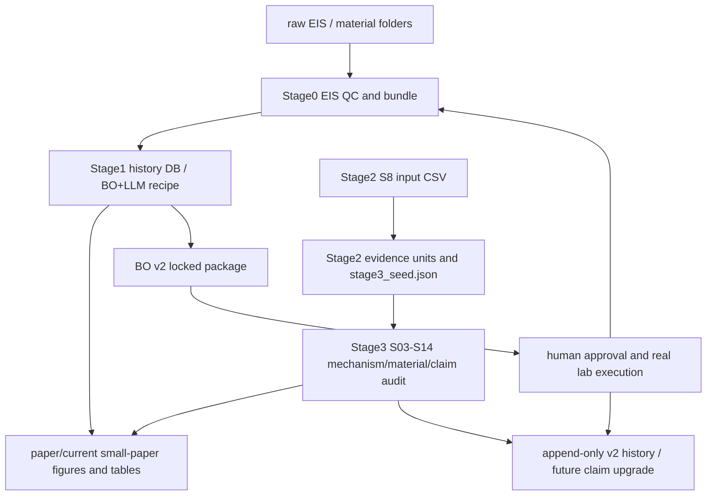

# Acid-in-Clay Close 项目说明书（代码依据版）

生成日期：2026-06-04  
项目根目录：`C:\Users\JZ\Desktop\paper\acid-in-clay-close`  
主要代码目录：`C:\Users\JZ\Desktop\paper\acid-in-clay-close\V1.0-qianduan-mainline`

## 0. 阅读原则

这份说明用于让一个不了解本项目的人快速理解项目结构、数据状态、代码链路、当前进展和后续优化入口。它刻意不把此前多轮 agent 生成的计划文档当作主要证据，而是以当前文件系统中的源码、配置、数据目录和 QC 报告为依据。

需要特别注意：

- 本项目不是一个单纯的软件项目，而是一个“材料实验 + EIS 数据处理 + BO/LLM 闭环 + 论文包 + v2 prospective 实验协议”的混合科研项目。
- 目前真正的项目主体在 `V1.0-qianduan-mainline/` 中；根目录下旧代码大量显示为 Git 删除状态，而 `V1.0-qianduan-mainline/`、`paper/current/`、`codex/` 当前又显示为未跟踪目录。也就是说，不应直接用当前 Git 状态判断项目完整性。
- 当前小论文版本已经有冻结/投稿前包；v2 处于“代码和协议基本准备、真实实验尚未执行”的状态。
- EIS/KK/Rb/DRT 输出必须按 QC/筛选证据处理，不能写成机制证明。

## 1. 项目一句话概括

本项目研究酸-黏土限域质子导体（acid-in-clay proton conductor），以凹凸棒土 Attapulgite/Palygorskite AiCE 体系为当前核心对象，使用 EIS 宽温数据、Arrhenius 分段分析、Bayesian Optimization、LLM 策略守门和 Stage3 机制/材料候选审计来构建一个可审计的材料优化与论文产出系统。

当前项目分两条线：

1. 小论文线：基于当前已有数据和审计结果，形成一个保守投稿版本。
2. v2 升级线：在不污染已冻结版本的前提下，建立 prospective locked execution engine，后续通过真实实验争取更高水平期刊。

## 2. 当前总体结论

### 2.1 已经真实存在的能力

- Stage0 有真实 EIS QC/分析代码：QA、KK、Rb、电导率、Arrhenius、可选 DRT、bundle 构建。
- Stage1 有真实 BO+LLM 单目标闭环入口：可读取 Stage0 结果、写入 history DB、调用 BO、调用 LLM 策略规划、输出下一轮 recipe。
- Stage2 有真实统计/证据构建代码：从 S8/S8-like CSV 生成 evidence units、sample summary、segment fits、Stage3 seed。
- Stage3 有完整 S03-S14 机制/候选/排序/registry/validation/claim audit 管线。
- paper/current 有冻结小论文包、图表、claim map、投稿前 QC、v2 locked pre-lab package。
- v2 工具有 hash manifest、approval binding、append-only、manual Rb QC、score layer、text claim、memory safety、claim unlock 等检查器。

### 2.2 尚未完成的能力

- 还没有一个统一的 v2 总控 runner 把 Stage0 + Stage1/MOBO + Stage3 + paper claim gate 完整串成一个真实 prospective campaign。
- MOBO 已实现，但没有接入 Stage1 主闭环，也没有接入 paper/current 的 v2 locked rounds。
- Stage3 agentic memory/critic/heartbeat 已实现并测试，但不是主 orchestrator 的实际控制层。
- Stage3 到 Stage1 的桥接 `s09b_top_list_to_campaign_seed.py` 是 legacy/optional，并且参数空间仍有不匹配风险。
- v2 locked package 目前是 pre-lab protocol，不是实验结果。
- R3/R4 是锁定建议与守门调整，不是实际 lab execution 结果。
- Nature Communications 级别 claim 尚未具备真实 prospective evidence 支撑。

## 3. 顶层目录结构

当前根目录主要内容：

```text
C:\Users\JZ\Desktop\paper\acid-in-clay-close
├── V1.0-qianduan-mainline/   # 主代码、数据、Stage0/1/2/3、测试、后端、前端
├── paper/current/            # 当前小论文稿件、图表、QC、冻结包、v2 locked package
├── codex/                    # 辅助审计工具、v2 dry-run 工具、phase B/C 计划产物
├── .cursor/                  # Cursor plan 文件
├── .git/                     # Git 元数据；当前状态很脏，不适合作为唯一依据
└── PROJECT_SYSTEM_OVERVIEW_CODE_GROUNDED_20260604.md
```

`V1.0-qianduan-mainline/` 内部结构：

```text
V1.0-qianduan-mainline/
├── backend_api/              # FastAPI 后端，统一 REST/SocketIO API
├── frontend/                 # Vite + React 前端
├── data/                     # 原始/中间科研数据，raw_eis 最大
├── code/                     # Stage0 processing、Stage2 preprocessing 等辅助脚本
├── stage0_measurement/       # EIS 测量/离线分析/QC/ResultBundle
├── stage1_optimization/      # BO+LLM 优化闭环、history DB、campaign config
├── stage2_statistics/        # 统计证据生成、Stage3 seed
├── stage3_mechanism/         # 机制/材料候选/排序/audit/claim gate
├── tests/                    # 主线跨阶段测试
├── scripts/                  # mainline audit 工具
├── output/                   # 各类输出
└── runs/                     # 运行记录
```

## 4. 总体数据流



重要边界：

- Stage2 的 `stage3_seed.json` 输入 Stage3，但 Stage3 当前并不会自动驱动 Stage1 实验。
- Stage1 当前主闭环使用单目标 `BayesianOptimizer`，不是 MOBO。
- paper/current 的 v2 package 从 Stage1 history 生成 prospective round templates，但目前没有真实 v2 实验结果。
- Stage0/EIS 输出支撑 QC/筛选/趋势，不等于机制证明。

## 5. Stage0：EIS 测量、QC、Rb、电导、Arrhenius

### 5.1 代码位置

主要目录：

- `V1.0-qianduan-mainline/stage0_measurement/`
- `V1.0-qianduan-mainline/code/stage0_processing/`

关键文件：

- `stage0_measurement/run_offline.py`
- `stage0_measurement/run_online.py`
- `stage0_measurement/build_stage0_bundles.py`
- `stage0_measurement/modules/analysis/eis_pipeline.py`
- `stage0_measurement/modules/analysis/algorithms/kk_validation.py`
- `stage0_measurement/modules/analysis/algorithms/rb_fitting.py`
- `stage0_measurement/modules/analysis/algorithms/arrhenius.py`
- `stage0_measurement/modules/analysis/algorithms/drt_analysis.py`
- `stage0_measurement/modules/io_utils/result_bundle.py`
- `code/stage0_processing/process_new_materials_stage0.py`
- `code/stage0_processing/run_stage0_wrapper.py`

### 5.2 Stage0 做什么

Stage0 负责从 EIS 原始/导出数据中得到每个温度点的：

- 质量检查结果；
- KK 一致性指标；
- Rb 拟合结果；
- 电导率；
- Arrhenius 分段拟合；
- 每个样品的 Stage0ResultBundle；
- 后续 Stage1/论文图表可读取的标准化数据。

### 5.3 `analyze_eis_point` 的实际逻辑

核心入口是：

```text
stage0_measurement/modules/analysis/eis_pipeline.py
```

执行顺序：

1. 输入频率、Zreal、Zimag、温度、厚度、面积。
2. 基础输入验证：少于 5 个点或长度不一致会拒绝。
3. QA 数据质量检查。
4. KK 一致性检查。
5. Rb 拟合和电导率计算。
6. 可选 DRT。
7. 输出统一 dict。

关键规则：

- QA 若出现 F 级且 fatal_check，则 `status='REJECTED_BY_QA'`，立即熔断。
- KK 若 `is_valid=False`，只设置 `kk_warning=True`，不会阻断 Rb/电导率。
- Rb 拟合失败会进入 `PARTIAL`。
- DRT 默认 `run_drt=False`。

### 5.4 Rb 与 conductivity

Rb 拟合在：

```text
stage0_measurement/modules/analysis/algorithms/rb_fitting.py
```

该模块会尝试从 Nyquist/EIS 数据中找 Rb，并计算：

```text
conductivity = thickness_cm / (Rb_ohm * area_cm2)
```

当前版本已经有多策略兜底，但对于论文级结论，仍需要人工 Rb QC 或至少对关键点做可视化/手工复核。

### 5.5 KK 的边界

KK 使用 `impedance.validation.linKK`。ResultBundle 中已经支持 `kk_residual`，其语义是 `mu_median_linKK`。但要注意：

- 新 bundle 可以记录数值 KK residual。
- 旧记录可能只有 `kk_warning`，没有数值 residual。
- 当前 Stage0 设计是 KK warning 模式，不是硬门禁。

这意味着：

- 可以说“该点有 KK 警告/通过或未通过 QC”；
- 不应说“KK 证明该机制正确”；
- 对关键 claim，应要求人工检查和补充 sidecar。

### 5.6 DRT 的边界

当前 DRT 代码中仍有后处理非负截断：

```text
G = np.maximum(G, 0)
```

这不是严格的 NNLS constrained DRT。因此 DRT 目前只能作为 exploratory/screening 输出，不适合作为机制证明的核心证据。

### 5.7 新材料处理

`code/stage0_processing/process_new_materials_stage0.py` 用于处理 `data/新材料` 等新材料文件夹。它做：

- 识别测量 txt；
- 从文件名解析温度；
- 从 recipe/元数据解析几何参数；
- 标准化输入；
- 调用 Stage0 offline；
- 读取 code Rb；
- 尝试读取 manual Excel Rb；
- 比较 code/manual；
- 重建 averaged temperature point 的 Stage0 报告。

这个脚本对后续 Phase C 很重要，因为真实实验后的 raw EIS 需要进入类似流程。

## 6. Stage1：BO+LLM 优化闭环

### 6.1 代码位置

主要目录：

```text
V1.0-qianduan-mainline/stage1_optimization/
```

关键文件：

- `run_optimization_loop.py`
- `suggest_next.py`
- `campaigns/attapulgite_aice_campaign.json`
- `campaign_memory/history_db_attapulgite.json`
- `campaign_memory/memory_manager.py`
- `canonical_input/state0_parser.py`
- `optimizers/bayesian_opt.py`
- `optimizers/mobo_optimizer.py`
- `agents/llm_client.py`
- `agents/strategy_planner.py`
- `closed_loop/round_logger.py`
- `closed_loop/termination_evaluator.py`

### 6.2 当前 campaign

当前凹凸棒土 AiCE campaign：

```text
stage1_optimization/campaigns/attapulgite_aice_campaign.json
```

核心参数：

- `campaign_name`: `Attapulgite_AiCE_Wide_Temp_Optimization`
- 参数：`R`, `N`
- R 范围：`[0.0, 1.04]`
- N 范围：`[0.5, 1.3]`
- history DB：`campaign_memory/history_db_attapulgite.json`
- 输出目录：`output/attapulgite_aice`

当前单目标 objective：

```text
combined_score = log10(conductivity_room_temp_S_cm)
                 - 3.0 * ea_high_temp_eV
                 - 0.5 * ea_low_excess_eV
```

含义：

- 奖励室温电导率；
- 惩罚高温段 Ea；
- 惩罚低温退化 `ea_low_excess_eV = max(0, Ea_low - 1.5 * Ea_high)`。

### 6.3 当前 Stage1 数据状态

当前 `history_db_attapulgite.json` 有 8 条 trial：

```text
T1  R=0.186  N=1.029  sample=ATA-2026-5-11-R0.186-N1.029
T2  R=0.35   N=0.95   sample=ATA-2026-5-12-R0.35-N0.95
T3  R=0.62   N=0.72   sample=R0.62-N0.72-2
T4  R=0.5    N=0.5    sample=R0.5-N0.5-2
T5  R=0.5    N=1.2    sample=R0.5-N1.2-2
T6  R=0.64   N=0.58   sample=BO-R0.64-N0.58-7ffv-2
T7  R=0.2    N=1.1    sample=BO-R0.20-N1.10-746i-2
T8  R=0.5    N=0.9    sample=BO-R0.50-N0.90-23yp-2
```

v2 package 中把 T1 保留在 full audit，但 primary protocol-consistent set 使用 T2-T8。这是因为 T1 制样条件和后续 T2-T8 不完全一致。

### 6.4 `run_optimization_loop.py`

这是完整闭环入口：

1. 读取 campaign config。
2. 初始化 MemoryManager。
3. 初始化 State0Parser。
4. 初始化 ParameterSpace。
5. 初始化 `BayesianOptimizer`。
6. 初始化 LLMClient 和 StrategyPlanner。
7. 解析 Stage0 当前结果。
8. 写入 history DB。
9. BO 建议下一组 R/N。
10. LLM 策略规划，可调整 BO 建议。
11. SafetyValidator 检查。
12. 写出 `next_experiment_recipe.json` 和 closed_loop round artifacts。

CLI 模式：

- `replay`
- `virtual_oracle`
- `real`

`real` 模式下，如果 Stage0 参数或 objective 无效，会拒绝写 history DB 和生成 recipe。这是一个重要保护。

### 6.5 `suggest_next.py`

这是“只建议、不写库”的入口：

- 读取现有 history DB；
- 调用 BO；
- 调用 LLM planner；
- 写 recipe；
- 不重复 ingest Stage0。

适合在 history 已经足够时生成下一轮建议。

### 6.6 当前 BO 的真实情况

主闭环使用：

```text
optimizers/bayesian_opt.py
```

这是单目标 BO。它读取 campaign objective `combined_score`，并使用 `scikit-optimize` 的 GP/EI 等策略生成建议。

风险点：

- 当 `random_state=None` 时，代码会根据历史数量生成动态 seed，不是完全固定。
- LLMClient 默认 temperature 是 `0.2`，不是完全确定性。
- 这条主线不是 MOBO。

### 6.7 MOBO 的真实情况

`optimizers/mobo_optimizer.py` 已经存在，目标包括：

- `sigma_RT` maximize
- `Ea_high` minimize
- `ea_low_excess` minimize

并实现：

- Pareto dominance；
- Pareto front；
- `score_v3 = log10(sigma_RT) - Ea_high - 0.2 * ea_low_excess`；
- hypervolume；
- ParEGO-style MOBO。

但该文件自己明确说明它是 independent v2 capability，未接入 frozen single-objective closed loop。因此当前不能把主闭环称为 MOBO v2，除非后续真正接入。

## 7. Stage2：统计证据与 Stage3 seed

### 7.1 代码位置

主要目录：

```text
V1.0-qianduan-mainline/stage2_statistics/
```

关键文件：

- `main_agent.py`
- `core/schema_v2.py`
- `core/stage3_seed_builder.py`
- `core/segment_fitter.py`
- `core/meyer_neldel_segment.py`
- `specialists/trend_analyzer.py`
- `specialists/model_competitor.py`
- `specialists/morphology_expert.py`
- `specialists/evidence_synthesizer.py`
- `exports/stage3_seed.json`

### 7.2 输入和输出

主要输入：

```text
stage2_statistics/data/s8_input.csv
```

主要输出：

```text
stage2_statistics/exports/
├── canonical_raw_points.csv
├── row_level_qc.csv
├── sample_level_summary.csv
├── segment_level_arrhenius.csv
├── model_comparison_by_sample.csv
├── evidence_units.json
├── stage3_seed.json
├── data_profile.json
├── execution_plan.json
├── visualization_manifest.json
└── run_summary.json
```

### 7.3 当前 Stage2 数据状态

从 `run_summary.json` 可见：

- 原始数据行：1081
- 清洗后数据行：1031
- 排除记录：50
- evidence units 总数：54（V1 atlas 口径）
- 数据范围：宽温区约 182.15 K 到 299.15 K
- 包含 R、N、sigma、Ea、Rb、EIS morphology 等列

注意：`run_summary.json` 在 PowerShell `ConvertFrom-Json` 解析时出现错误，说明该 JSON 可能包含未转义或编码问题。内容能读，但这是复现风险点，后续应修复。

### 7.4 `stage3_seed.json`

当前 Stage2 到 Stage3 的主输入是：

```text
stage2_statistics/exports/stage3_seed.json
```

当前状态：

- `stage3_ready = true`
- `source_mode = retrospective`
- `source_system = s8_reference`
- `sample_summary_count = 40`
- `segment_fits_count = 158`
- `evidence_units_count = 13`
- `top_candidate_regions_count = 3`
- `unresolved_questions_count = 1`

这点非常重要：Stage3 当前使用的是 retrospective S8 reference seed，不是新 v2 实验产生的 seed。因此 Stage3 可以支持机制假设和候选生成，但不能直接证明新的 prospective discovery。

### 7.5 Stage2 的实现细节

`main_agent.py` 中的 `Stage2Agent.run_pipeline()` 做：

1. 读取 CSV。
2. 数据 profiler。
3. 数据清洗和 sanity check。
4. 运行多个 specialists：
   - sanity checker；
   - trend analyzer；
   - model competitor；
   - morphology expert；
   - evidence synthesizer。
5. 生成 atlas。
6. 导出 metadata、excluded samples、run summary。
7. 调用 `_export_stage3_seed_pipeline()` 生成 V2 schema 的 `stage3_seed.json`。

`core/schema_v2.py` 明确说明 `Stage3Seed` 是 Stage2 到 Stage3 的唯一主输入。

## 8. Stage3：机制、文献、候选材料、排序和 claim gate

### 8.1 代码位置

主要目录：

```text
V1.0-qianduan-mainline/stage3_mechanism/
```

源码主包：

```text
stage3_mechanism/src/s8_stage3/
```

主要子目录：

- `orchestrator/`
- `agents/`
- `contracts/`
- `config/`
- `literature/`
- `scoring/`
- `validation/`
- `agentic/`
- `mock/`

### 8.2 主入口

CLI：

```text
stage3_mechanism/src/s8_stage3/orchestrator/run_stage3.py
```

默认参数：

- `--mode mock`
- `STAGE3_RUN_MODE=mock`
- `STAGE3_LLM_MODE=mock`
- `STAGE3_LITERATURE_MODE=mock`

这意味着不显式指定时，Stage3 默认不是 live LLM，不是真实文献 API。

### 8.3 Stage3 可执行步骤

Stage3 orchestrator 从 S03 开始：

```text
s03_evidence_builder
s04_hypothesis_generator
s05_literature_scout_mechanism
s06_mechanism_arbiter
s06b_design_principle_extractor
s07_descriptor_extractor
s08_literature_scout_materials
s09_candidate_family_generator
s10_instance_ranker
s12_prospective_registry
s13_validation_binder
s14_claim_auditor
s11_report_compiler
```

Pipeline 中确实调用了 S12/S13/S14：

- S12 prospective registry；
- S13 validation binder；
- S14 claim auditor。

### 8.4 S08 文献

`s08_literature_scout_materials.py` 支持：

- `mock`
- `manual`
- `api`
- `hybrid`

真实 API 路径目前主要是 OpenAlex：

```text
stage3_mechanism/src/s8_stage3/literature/providers/openalex_provider.py
```

虽然 settings 中有 Semantic Scholar API key 字段，但当前可见的 S08 API provider 主要是 OpenAlex，不应声称已经有完整 Semantic Scholar/Crossref/Scopus 联动。

### 8.5 S09 候选生成

`s09_candidate_family_generator.py` 有三类路径：

1. 默认 deterministic D4 path。
2. opt-in evidence-based generation。
3. LLM fallback。

默认情况：

- `s09_deterministic_from_d4 = True`
- `s09_evidence_based_generation = False`

因此当前默认候选不是纯 LLM 自由发现，而是固定、可审计的 D4 deterministic 组合。Evidence-based S09 已经实现，但需要显式打开。

### 8.6 S10 排序

`s10_instance_ranker.py` 和 `scoring/candidate_audit.py` 的关键事实：

- LLM 可给候选解释和定性理由；
- 但最终会由 deterministic candidate audit 重新计算分数；
- 输出 `candidate_audit.json`、`score_override_log.json`、`deterministic_reranked_top_list.json`；
- `ranking_robustness_v2.py` 会做 200-seed perturbation robustness。

Candidate audit 中计算：

- mechanism fit；
- evidence quality；
- formulation completeness；
- low-temperature plausibility；
- processability；
- novelty；
- citation validity；
- risk penalty；
- prospective_status_score。

`prospective_status_score` 只有在提供 S13 validation binding 且候选有 bound prospective record 时才为 1.0；默认 live S10 前一般是 0.0。

### 8.7 S13/S14

S13：

```text
agents/s13_validation_binder.py
```

作用：把 validation data 绑定到 S12 prospective registry。它不会修改 S09/S10/S12，只追加 validation binding 证据。

S14：

```text
agents/s14_claim_auditor.py
```

作用：生成 claim ladder、publication blockers、recommended wording。它还会读取 Stage1 closed loop metrics、S13 binding、source term audit、ranking robustness 等。

S14 重要边界：

- 不调用 LLM；
- 是 deterministic claim audit；
- 对 EIS overclaim 有 guardrail；
- 默认 EIS absolute guardrail 是 advisory，strict 模式才会作为 blocker。

### 8.8 Agentic layer 的真实状态

`agentic/` 中有：

- `memory.py`
- `critic.py`
- `heartbeat.py`

测试文件明确说明它们是 standalone v2 capabilities，不接入 frozen linear orchestrator。也就是说：

- 代码真实存在；
- 有测试；
- 但不是当前 Stage3 主流程的实际控制层。

不能直接声称当前 Stage3 是有 memory/heartbeat/self-critic 的真实 agent unless 后续把它接入主 pipeline。

### 8.9 Stage3 到 Stage1 的桥

`agents/s09b_top_list_to_campaign_seed.py` 是 optional/legacy bridge。它把 Stage3 top list 转成 Stage1 campaign seed。

但它自己警告：

- 不属于 canonical Stage3 S01-S14 pipeline；
- 没有被 `orchestrator/pipeline.py` 导入；
- 默认参数空间仍镜像 S8 sepiolite；
- N 范围不匹配当前 attapulgite AiCE campaign。

因此后续不能直接使用它做 v2 主线，必须先 campaign-aware 修复。

## 9. paper/current：当前小论文、图表、冻结包和 v2 package

### 9.1 目录结构

```text
paper/current/
├── figures/          # 当前图
├── figure_data/      # 当前图对应源数据
├── tables/           # 当前表
├── supplement/       # 补充材料
├── qc/               # QC 报告和门禁
├── reproducibility/  # 冻结包、v2 locked package
├── scripts/          # 论文包、QC、v2 gates 构建脚本
├── package_builds/   # 一键构建输出包
└── manuscript_*.md   # 多个稿件版本
```

### 9.2 当前图表状态

当前 `paper/current/figures` 有 21 个文件，主要包括：

- Fig1 agentic workflow；
- Fig2 BO/LLM tradeoff；
- Fig3 Stage3 ranking；
- Fig4 wide-temperature conductivity；
- Fig5 Ea benchmark；
- Fig6 EIS QC boundary；
- Fig7 BO objective audit。

当前 `paper/current/tables` 有 5 个文件：

- `agent_claim_map.csv`
- `bo_trial_table.csv`
- `final_benchmark_table.csv`
- `sample_master_registry.csv`
- `sample_preparation_provenance_20260527.csv`

当前 `figure_data` 有 15 个文件，是图对应的数据源。

### 9.3 当前小论文状态

已有 QC 报告显示：

- `presubmission_internal_audit`: `PASS_PRESUBMISSION_INTERNAL_AUDIT_READY`
- `upgrade_status_dashboard`: `PASS_CURRENT_VERSION_LOCKED_V2_PENDING_LAB_EXECUTION`
- `current_version_status`: `LOCKED_SMALL_PAPER_BASELINE_OK`
- `frozen_protected_drift_count`: 0

因此当前小论文可作为保守投稿基础。

但要注意：

- 它不是 Nature Communications 级别 v2 prospective discovery 结果。
- 文稿里不能把 v2 pre-lab package 说成已完成实验。
- 不能把 EIS/Rb/KK/DRT 写成机制证明。

### 9.4 paper/current/scripts

`paper/current/scripts` 是当前很重要的工具层，包含：

- 图表构建；
- paper package build；
- frozen baseline guard；
- presubmission audit；
- manuscript claim gate；
- BO v2 locked package；
- v2 approval gate；
- v2 CHI preflight gate；
- v2 raw EIS intake；
- v2 Stage0 input staging；
- v2 manual Rb QC；
- v2 score gate；
- v2 append-only history import；
- v2 claim upgrade gate；
- v2 release readiness gate。

这套脚本是当前“小论文冻结 + v2 预实验安全门”的核心。

## 10. v2 locked prospective package

### 10.1 位置

```text
paper/current/reproducibility/bo_v2_locked/
```

关键文件：

- `protocol_lock.json`
- `attapulgite_aice_v2_locked_campaign.json`
- `history_primary_t2_t8.json`
- `history_primary_t2_t8.csv`
- `history_full_audit_t1_t8.json`
- `prospective_round_templates.json`
- `round_package_schema.json`
- `execution_engine/`
- `round_01_v2-R1_locked_repeat/`
- `round_02_v2-R2_locked_repeat/`
- `round_03_v2-R3_raw_bo_suggestion/`
- `round_04_v2-R4_llm_guardrail_adjusted/`

### 10.2 当前状态

`protocol_lock.json`：

- `artifact_type = bo_v2_protocol_lock`
- `status = LOCKED_BEFORE_NEW_V2_RESULTS`
- claim boundary: execution proof only; not causal discovery route for LRS。

Release readiness：

- `status = PASS_CURRENT_VERSION_READY_V2_PENDING_LAB_EXECUTION`
- package build PASS；
- 421 files；
- v2 execution status pending；
- `safe_to_start_lab_now_count = 0`
- `result_like_file_count = 0`
- `existing_v2_data_dir_count = 0`

这说明：

- 当前 v2 执行协议和包已经准备；
- 当前没有 v2 真实结果；
- 当前不能导入 v2 history；
- 当前不能升级 v2 claim。

### 10.3 四个 round

当前 round templates：

1. `v2-R1 locked_repeat`
   - repeat T5 高电导端点。
2. `v2-R2 locked_repeat`
   - repeat T7 低 Ea_high 端点。
3. `v2-R3 raw_bo_suggestion`
   - 当前 raw suggestion：`R=0.64, N=1.04`
   - 状态：`PROTOCOL_LOCKED_RAW_BO_SUGGESTION_NOT_EXECUTED`
   - 方法：fixed-hyperparameter GP + EI over `score_v3`
4. `v2-R4 llm_guardrail_adjusted`
   - 当前 final parameters：`R=0.64, N=1.02`
   - 状态：`LLM_GUARDRAIL_DECISION_LOCKED_NOT_EXECUTED`

### 10.4 R3/R4 的边界

R3 的 BO 不等于 Stage1 `BayesianOptimizer` 主闭环，也不是 MOBO。它是固定超参数 GP + EI over `score_v3`。

R4 的 `llm_guardrail.json` 当前是 Codex/GPT-5 coding agent guardrail review 结果，不是实时 LLM API 调用的记录。因此：

- 可以说“agent/reviewer guardrail adjusted recipe”；
- 不宜直接说“真实 LLM execution engine 已自动完成 v2 决策”，除非后续补接真实 LLM 调用记录和 prompt hash。

### 10.5 v2 execution engine

`build_bo_v2_execution_engine.py` 定义了硬门禁：

- append-only；
- hash-bound human approval；
- human approval before raw collection；
- no preapproval write commands；
- manual EIS only until CHI macro/dummy-cell evidence；
- automated CHI blocked；
- raw EIS intake requires content QC；
- Stage0 EIS submission gate；
- manual Rb QC；
- score gate before history import；
- append-only history after score gate；
- no current package overwrite；
- no hysteresis claim without sequence evidence；
- no mechanism proof without advanced impedance sidecar。

这套设计方向是正确的，但目前仍停留在 pre-lab protocol 阶段。

## 11. codex 辅助工具

### 11.1 v2_engine_tools_20260601

位置：

```text
codex/v2_engine_tools_20260601/
```

主要脚本：

- `build_round_hash_manifest.py`
- `verify_approval_binding.py`
- `verify_append_only_chain.py`
- `validate_manual_rb_qc.py`
- `validate_score_layers.py`
- `summarize_kk_residuals.py`
- `verify_text_claims.py`
- `verify_memory_safe.py`
- `check_chi_automation_preconditions.py`
- `v2_claim_unlock_check.py`
- `run_all_checks.py`

性质：

- 这是 v2 安全/QC checker；
- 默认 HOLD-biased；
- 不能单独解锁科学 claim；
- 只有真实 evidence map + 完整 hash manifest + 所有条件满足才可能 ALLOW。

### 11.2 v2_phase_b_intelligence_dryrun_20260602

位置：

```text
codex/v2_phase_b_intelligence_dryrun_20260602/
```

性质：

- 使用 synthetic_not_real_evidence；
- 离线 fake OpenAlex；
- 测 S08 api plumbing；
- 测 S09 baseline vs evidence-based；
- 测 memory/critic/heartbeat；
- 测 EIS overclaim guardrail；
- 检查 protected evidence 未变。

它是 dry-run，不是科学结果。

### 11.3 v2_phase_c_experiment_protocol_20260602

位置：

```text
codex/v2_phase_c_experiment_protocol_20260602/
```

包含：

- `PHASE_C_EXPERIMENT_PROTOCOL...`
- `phase_c_sample_matrix.csv`

它是实验协议/样本矩阵草案，不是已完成实验。

## 12. 数据目录情况

### 12.1 `V1.0-qianduan-mainline/data`

顶层：

```text
data/
├── ao/
├── canonical_inputs/
├── knowledge_base/
├── literature/
├── phase1_results/
├── raw_eis/
└── 新材料/
```

文件类型数量：

- `.DTA`: 2665
- `.txt`: 651
- `.z60`: 340
- `.json`: 117
- `.bin`: 36
- `.png`: 35
- `.pdf`: 22
- `.seq`: 18
- `.GSequence`: 17
- `.xlsx`: 8

按目录粗略数量：

- `raw_eis`: 2710
- `新材料`: 655
- `ao`: 413
- `phase1_results`: 58
- `canonical_inputs`: 58
- `literature`: 22

### 12.2 重要保护数据

后续 agent 或开发者不要随便修改：

```text
paper/current/**
V1.0-qianduan-mainline/data/**
V1.0-qianduan-mainline/stage2_statistics/exports/stage3_seed.json
V1.0-qianduan-mainline/stage1_optimization/campaign_memory/history_db_attapulgite.json
V1.0-qianduan-mainline/stage3_mechanism/data/validation/experimental_feedback.json
V1.0-qianduan-mainline/stage3_mechanism/outputs/verification/**
```

如果要做 v2 实验或新版本，应写入新目录、新 round 或新 package，不应覆盖冻结证据。

## 13. 后端和前端

### 13.1 backend_api

位置：

```text
V1.0-qianduan-mainline/backend_api/
```

主入口：

```text
backend_api/main.py
```

特点：

- FastAPI；
- SocketIO 可选；
- 包含 REST routers：
  - control；
  - data；
  - agent；
  - agents；
  - runs；
  - pipeline；
  - demo；
  - evidence_jobs；
  - samples；
  - campaigns。

重要注释：

- mutating `/api/pipeline` triggers 被禁用；
- 当前主线使用 `/api/control` 加 direct Stage2/Stage3 CLIs。

运行方式：

```powershell
cd C:\Users\JZ\Desktop\paper\acid-in-clay-close\V1.0-qianduan-mainline
uvicorn backend_api.main:app --host 0.0.0.0 --port 8000 --reload
```

### 13.2 frontend

位置：

```text
V1.0-qianduan-mainline/frontend/
```

技术栈：

- Vite；
- React 18；
- Ant Design；
- ECharts；
- Socket.IO client；
- Zustand；
- i18next。

运行：

```powershell
cd C:\Users\JZ\Desktop\paper\acid-in-clay-close\V1.0-qianduan-mainline\frontend
npm install
npm run dev
```

前端更像项目 dashboard/UI，不是科研分析的唯一入口。

## 14. 测试与审计

### 14.1 主线测试

主线测试目录：

```text
V1.0-qianduan-mainline/tests/
```

包含：

- `test_mainline_audit_contract.py`
- `test_mobo_optimizer_tier3.py`
- `test_paper_bo_v2_gate_contracts.py`
- `test_stage0_bundle_kk_rb.py`
- `test_stage0_stage1_contracts.py`
- `test_stage1_recipe_schema_contracts.py`
- `test_stage2_current_seed_contract.py`
- `test_stage2_plots_tier2.py`
- `test_tier1_termination_lockdown.py`
- `test_v1v2_seed_path_isolation.py`

### 14.2 Stage3 测试

Stage3 测试目录：

```text
V1.0-qianduan-mainline/stage3_mechanism/tests/
```

包含：

- agentic layer；
- contracts；
- EIS overclaim guardrail；
- instance id stability；
- literature workflow；
- LLM gateway；
- no material leakage；
- pipeline smoke；
- prompt loading；
- ranker constraints；
- S08 OpenAlex；
- S09 evidence-based；
- Stage2-Stage3 contract；
- cache contract；
- source term audit；
- tier lockdown。

### 14.3 mainline audit

主审计脚本：

```text
V1.0-qianduan-mainline/scripts/audit_mainline.py
```

它会检查：

- Stage1 recipe；
- LLM config；
- Stage2 seed；
- Stage3 manifests；
- validation feedback；
- legacy root path；
- possible API key hits；
- campaign/objective 等。

它是 read-only audit，默认写报告到 `codex`。

## 15. 当前 claim 边界

### 15.1 当前可以较稳妥表达的内容

- 已有 acid-in-clay / attapulgite AiCE 数据支持宽温 EIS screening。
- BO/LLM 工具链已经形成可审计 recipe 生成和 closed-loop artifact 记录。
- Stage2/Stage3 能把 retrospective evidence 组织成机制假设、材料候选、排序和 claim audit。
- 当前小论文版本可作为保守投稿基础。
- v2 prospective execution package 已经锁定协议，并准备人工批准和真实实验。

### 15.2 当前不能表达的内容

不能说：

- “v2 实验已经完成”；
- “BO+LLM 已经发现 LRS/证明最优配方”；
- “EIS 证明机制”；
- “MOBO 已经驱动当前闭环”；
- “Stage3 memory/critic/heartbeat 已经是主流程真实 agent 控制层”；
- “Nature Communications 级别 prospective discovery evidence 已经就绪”；
- “CHI 自动化已准备好真实运行”。

### 15.3 v2 claim 何时可以升级

至少需要：

1. human approval hash-bound；
2. raw EIS append-only；
3. Stage0 result gate pass；
4. manual Rb QC acceptable；
5. score gate pass；
6. append-only history import reviewed；
7. Stage3 rerun claim gate pass；
8. 新冻结版本和 presubmission pass。

这些条件由 `v2_claim_unlock_check.py` 等工具表达，但当前尚未满足。

## 16. 后续优化的真正入口

### 16.1 不应继续做的事情

不建议继续生成泛泛的“v2 计划文档”，因为当前主要问题已经不是文字计划，而是代码集成和真实实验。

也不建议继续把 dry-run 或 synthetic evidence 包装成进展。dry-run 的作用是证明工具链安全，不是科学结果。

### 16.2 第一优先级：v2 总控 runner

应新增或重构一个真正的 v2 总控入口，目标是把以下内容串起来：

```text
history_db_attapulgite.json
        ↓
v2 optimizer decision (scalar BO or MOBO)
        ↓
LLM/critic guardrail, with prompt hash and model record
        ↓
locked recipe package
        ↓
human approval
        ↓
manual raw EIS acquisition
        ↓
Stage0 QC
        ↓
manual Rb QC
        ↓
score gate / Pareto gate
        ↓
append-only history_after
        ↓
Stage3/S14 claim gate
```

当前 paper/current/scripts 已经有很多阶段性 gate，但缺一个清晰的“研究主控层”来表明 v2 的科学和代码路线。

### 16.3 第二优先级：决定 v2 是 scalar BO 还是 MOBO

当前有两套分数逻辑：

- Stage1 campaign 的 `combined_score`；
- v2 locked package 的 `score_v3` 和 Pareto front；
- MOBOOptimizer 的 Pareto/ParEGO 能力。

如果目标是顶级期刊，建议优先升级为真正 MOBO/Pareto prospective campaign，因为这比单目标 score 更适合讲“高电导 + 低 Ea + 低温稳定”的多目标材料优化。

但这需要代码接入：

- `MOBOOptimizer` 接入 v2 runner；
- v2 package 记录 MOBO provenance；
- score_v3 作为 secondary score，而不是唯一核心。

### 16.4 第三优先级：真实 LLM guardrail 或改名

当前 R4 `llm_guardrail` 是 agent review，不是代码中实时 LLM API 调用。后续有两种选择：

1. 接入真实 LLM：
   - 记录 model；
   - 记录 prompt hash；
   - temperature=0；
   - seed/model snapshot；
   - cache；
   - structured output；
   - fallback。
2. 如果不接真实 LLM，就把命名改成 `agent_guardrail` 或 `human_or_agent_guardrail`，避免 claim overstatement。

### 16.5 第四优先级：Stage3 到 Stage1 桥接

如果要让 Stage3 候选材料进入实验优化，需要修复：

- `s09b_top_list_to_campaign_seed.py` 的 campaign-aware 参数空间；
- 当前 S8 sepiolite N 范围与 attapulgite AiCE N 范围不匹配；
- Stage3 candidate 是材料体系/组分建议，而 Stage1 当前只优化 R/N；
- 需要定义是“先选材料体系再优化 R/N”，还是“Stage3 只提供机制/组分 prior，Stage1 仍只优化当前 attapulgite”。

### 16.6 第五优先级：Stage0 投稿级 QC 强化

建议：

- 对关键 claim 点把 KK warning 从 advisory 改为 claim gate 的硬约束；
- DRT 改为 NNLS 或明确禁用机制 claim；
- 自动生成 per-point KK residual table；
- manual Rb QC 与 figure_data 绑定；
- 所有几何参数、厚度、面积、温度序列进入 bundle provenance；
- 对重复样品做 batch consistency。

### 16.7 第六优先级：文献 provider

Stage3 S08 当前真实 API 主要是 OpenAlex。若要增强材料发现可信度：

- 增加 Crossref；
- 增加 Semantic Scholar；
- 增加 PubMed/Scopus 替代或手动导入流程；
- 对每个 provider 记录 query、result hash、paper IDs、筛选理由；
- 防止 LLM 伪造文献。

## 17. 新智能体上手顺序

建议另一个智能体按以下顺序读：

1. 本说明文档。
2. `V1.0-qianduan-mainline/stage1_optimization/campaigns/attapulgite_aice_campaign.json`
3. `V1.0-qianduan-mainline/stage1_optimization/run_optimization_loop.py`
4. `V1.0-qianduan-mainline/stage1_optimization/optimizers/mobo_optimizer.py`
5. `V1.0-qianduan-mainline/stage0_measurement/modules/analysis/eis_pipeline.py`
6. `V1.0-qianduan-mainline/stage0_measurement/modules/io_utils/result_bundle.py`
7. `V1.0-qianduan-mainline/stage2_statistics/core/schema_v2.py`
8. `V1.0-qianduan-mainline/stage2_statistics/core/stage3_seed_builder.py`
9. `V1.0-qianduan-mainline/stage3_mechanism/src/s8_stage3/orchestrator/pipeline.py`
10. `V1.0-qianduan-mainline/stage3_mechanism/src/s8_stage3/agents/s09_candidate_family_generator.py`
11. `V1.0-qianduan-mainline/stage3_mechanism/src/s8_stage3/scoring/candidate_audit.py`
12. `V1.0-qianduan-mainline/stage3_mechanism/src/s8_stage3/agents/s14_claim_auditor.py`
13. `paper/current/scripts/build_bo_v2_locked_package.py`
14. `paper/current/scripts/build_bo_v2_execution_engine.py`
15. `paper/current/scripts/build_bo_v2_r3_raw_suggestion.py`
16. `paper/current/scripts/build_bo_v2_r4_guardrail_decision.py`
17. `codex/v2_engine_tools_20260601/run_all_checks.py`

不要一开始就读旧文档、旧 paper_figure、archive 或 generated audit summary；那些容易造成误解。

## 18. 最小安全运行命令

### 18.1 Stage3 smoke/mock

```powershell
cd C:\Users\JZ\Desktop\paper\acid-in-clay-close\V1.0-qianduan-mainline\stage3_mechanism
$env:PYTHONPATH="src"
python src\s8_stage3\orchestrator\run_stage3.py --mode mock --llm-mode mock --literature-mode mock --output-dir outputs\stage3_smoke
```

### 18.2 Stage2 seed 重新生成（谨慎）

```powershell
cd C:\Users\JZ\Desktop\paper\acid-in-clay-close\V1.0-qianduan-mainline
python -m stage2_statistics.main_agent stage2_statistics\data\s8_input.csv --output-dir stage2_statistics\exports
```

注意：这会覆盖 `stage2_statistics/exports`，如果当前 seed 已冻结，不应直接运行。

### 18.3 Stage1 只建议、不 ingest

```powershell
cd C:\Users\JZ\Desktop\paper\acid-in-clay-close\V1.0-qianduan-mainline\stage1_optimization
python suggest_next.py --campaign campaigns\attapulgite_aice_campaign.json
```

需要检查实际参数；不要在未确认 CLI 参数前盲跑。

### 18.4 Stage1 真实模式

真实模式会写 history DB，必须确认 Stage0 result 和 sample 对应关系：

```powershell
python run_optimization_loop.py --mode real --campaign campaigns\attapulgite_aice_campaign.json --stage0-results-dir <stage0_result_dir>
```

运行前必须备份/冻结 history DB。

### 18.5 v2 release readiness

```powershell
cd C:\Users\JZ\Desktop\paper\acid-in-clay-close
python paper\current\scripts\run_v2_release_readiness_gate.py
```

该脚本可能刷新 QC 报告；审计时优先只读现有报告。

## 19. 当前最重要的风险清单

1. Git 状态很脏：旧根文件大量 deleted，新主目录 untracked。不要直接 commit/reset。
2. `stage2_statistics/exports/run_summary.json` 有 JSON 解析风险。
3. Stage1 主线不是 MOBO，LLM 温度不是 0。
4. v2 R3/R4 不是真实 lab result。
5. R4 不是代码实时 LLM API。
6. Stage3 默认 mock，S09 默认 deterministic D4。
7. Stage3 agentic memory/critic/heartbeat 未接主流程。
8. S09b bridge 参数空间不匹配当前 attapulgite campaign。
9. Stage0 KK warning 不是硬门禁。
10. DRT 不是严格 NNLS。
11. v2 claim 仍 HOLD，不能提前升级稿件。

## 20. 当前项目到什么地步

如果按科研项目成熟度分层：

### 小论文线

状态：基本可进入人工最终审稿/投稿前文字清理。

已有：

- 图表；
- figure_data；
- tables；
- claim map；
- frozen baseline guard；
- presubmission audit；
- package build；
- code audit；
- v2 不污染当前版本的边界。

还需要人工：

- 最后一轮 manuscript wording；
- reference 格式；
- claim wording；
- 期刊格式；
- 图注和补充材料一致性；
- 人工确认 EIS/QC 边界。

### v2 顶刊线

状态：pre-lab locked protocol ready，但真实 prospective evidence 未完成。

已有：

- v2 objective spec；
- primary T2-T8 history；
- score_v3；
- v2 round templates；
- locked protocol；
- approval/readiness/score/history/claim gates；
- Phase B dry-run；
- Phase C protocol草案。

还需要：

- 人工批准；
- 真实 EIS 实验；
- Stage0 QC；
- manual Rb QC；
- score gate；
- append-only history import；
- Stage3 rerun；
- claim gate；
- 新版本稿件。

## 21. 对后续智能体的明确任务建议

如果要继续优化项目，应把任务分成四类：

### Task A：代码级事实复核

目标：再次确认本说明中的每条关键结论是否仍成立。

检查：

- Stage1 是否仍使用 `BayesianOptimizer`；
- MOBO 是否仍未接入；
- Stage3 default 是否仍 mock；
- S09 evidence-based 是否默认 off；
- agentic 是否仍 standalone；
- v2 package 是否仍无 result-like files；
- protected evidence 是否稳定。

### Task B：v2 总控设计

目标：设计一个真正的 v2 runner，不修改 protected evidence。

输出：

- architecture spec；
- inputs/outputs；
- round state schema；
- optimizer choice；
- LLM/critic guardrail contract；
- Stage0/QC gate contract；
- claim gate contract；
- tests。

### Task C：MOBO 接入

目标：把 `MOBOOptimizer` 接入 v2 locked package 或新 v2 runner。

最低要求：

- 不影响 current small-paper；
- 使用 T2-T8 primary history；
- 输出 Pareto/score_v3/provenance；
- deterministic seed；
- tests 证明不是单目标 BO；
- claim wording 仍 HOLD。

### Task D：Phase C 实验执行

目标：人工批准后真实执行 v2 rounds。

步骤：

1. 生成/确认 human approval；
2. 手动 EIS；
3. append-only raw data；
4. raw EIS intake；
5. Stage0；
6. manual Rb；
7. score；
8. history_after；
9. Stage3/S14；
10. 新稿件 claim review。

## 22. 最后判断

这个项目不是“什么都没做”，也不是“已经 Nature Communications ready”。准确状态是：

- 小论文线：已经接近冻结投稿基础，后续主要是人工文本和 claim 审稿。
- v2 线：代码、门禁、协议、dry-run 已经形成，但真实 prospective 实验和总控集成还没完成。
- 真正的升级核心不是再写计划，而是把 MOBO/LLM/Stage3/Stage0 的代码边界打通，并通过真实实验产生可审计证据。

后续所有 agent 都应坚持一个原则：任何 claim 必须绑定到真实文件、hash、实验结果和 gate 报告；没有绑定证据的内容只能写成计划、假设或 dry-run。
