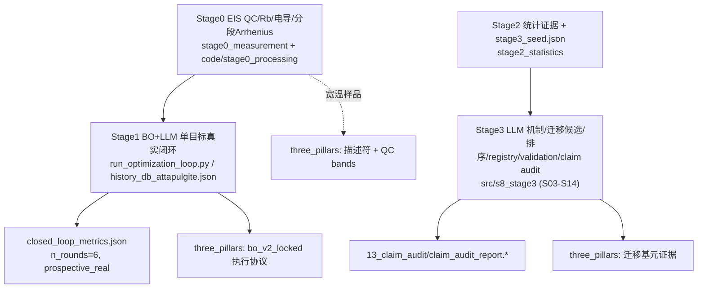

# 三创新点 · 架构 / 对应 / 子刊写作方案（代码与数据依据版）

> ⚠ **KK 符号更正（2026-06-10）**：本文中凡涉及"KK 警告""高温窗口非 KK 干净""headline 样品 KK 最脏"
> 的推理均**已被取代**。查明根因为一处复数阻抗符号约定 bug（`Z = Zr − jZi` 应为 `Z = Zr + jZi`），
> 修正 + 高频感性尾裁剪后全样 220 条谱 KK 警告由 133 降为 0、μ_median≈0.007，**数据 KK 干净**。
> Eₐ/σ 与 KK 无关、数值不变。最新结论见 `manuscript/build_draft_v1.py` 4.2 节与
> `three_pillars/pillar2_descriptor_qc/figure_data/KK_SIGN_CORRECTION.md`。

生成日期：2026-06-08
分析对象：`acid-in-clay-close`（清理后只剩 `V1.0-qianduan-mainline/` + `three_pillars/` + 本类说明文档）
分析方法：**不以历史计划文档为证据**，逐条核对当前文件系统中的源码、配置、QC 报告、claim audit 输出与真实数据。本文中每个数字 / 路径都来自实际读取。

本文分四部分：
- **Part A — 项目架构说明（主线识别）**
- **Part B — 三创新点 ↔ 代码 / 证据 对应分析报告**
- **Part C — 子刊写作方案 + 必须优化项（不依赖新表征）**
- **Part D — 前瞻升级执行方案（git 取证 + 当前排名 + 两条并行实验线）** ← 2026-06-08 追加

> 阅读提示：若你打算**重做实验冲更高级别**，直接看 Part D；Part C 仍是"不做新实验即可投子刊"的方案。

---

# Part A. 项目架构说明（主线识别）

## A.1 一句话

一个**物理 / QC / claim 受治理（governed）的 agentic 材料发现项目**：以 acid-in-clay 质子导体为母体系，用 LLM 证据约束的迁移智能体把"酸-黏土"证据迁移到"生物聚合物–黏土膜"基元，再用宽温 EIS + 分段 Arrhenius 的"冷却韧性通路连续性描述符"做正/边界验证，全过程用 BO+LLM 真实闭环执行并由确定性 claim audit 守门、拒绝过度声称。

## A.2 顶层结构（清理后）

```text
acid-in-clay-close/
├── V1.0-qianduan-mainline/   # 唯一代码主体：stage0/1/2/3 + backend + frontend + data + tests
├── three_pillars/            # 面向论文的三创新点证据投影（非代码，无多版本）
│   ├── pillar1_transfer_agent/        # 仅 README 指针 + S8 母体系 campaign
│   ├── pillar2_descriptor_qc/         # 描述符定义 + eis_qc_v2 + benchmark + figure_data/tables
│   └── pillar3_eis_in_the_loop/       # bo_v2_locked + v2_engine_tools + phase_b/c
└── PROJECT_SYSTEM_OVERVIEW_CODE_GROUNDED_20260604.md（含 06-08 增量摘要）
```

> `paper/` 与顶层 `codex/` 已于 2026-06-05 删除；V1.0 内部 Python **不 import `paper`/`codex`**，唯一一处运行期引用（`mobo_optimizer.py` 的 `objective_spec_ref`）已改指 `three_pillars/...`。删除是安全的。

## A.3 真正的"主线"是什么

主线是一条**单向、可审计的发现-执行-审计链**，锚定在凹凸棒土 AiCE（attapulgite）体系：



**权威快照（authoritative，2026-06-07 真实 LLM 跑数）**：
`V1.0-qianduan-mainline/stage3_mechanism/outputs/verification/20260607_openrouter_publication_v2/`
- `run_mode=real`，`literature_mode=hybrid`，`llm_mode=live`，`enable_cache=false`，`temperature=0.0`（OpenRouter：gpt-5.2 cheap/standard、gpt-5.4 premium）。
- 这是目前唯一可作为"投稿级"引用的 Stage3 输出；其余 `20260526_*` / `20260607_mixed_tier` / `post_cleanup_smoke` 仅作过程记录。

## A.4 各 Stage 现状（核对结论）

| Stage | 真实能力 | 关键路径 | 当前边界 / 风险 |
|---|---|---|---|
| Stage0 | EIS QA→KK→Rb→σ→分段 Arrhenius→bundle；新材料处理脚本 | `stage0_measurement/modules/analysis/eis_pipeline.py`、`code/stage0_processing/process_new_materials_stage0.py` | KK 是 **warning 非硬门禁**；DRT 用 `max(G,0)` 非严格 NNLS → 只能 screening |
| Stage1 | BO+LLM **单目标**真实闭环，写 history、出 recipe | `run_optimization_loop.py`、`optimizers/bayesian_opt.py`、`agents/strategy_planner.py` | 主闭环 = `BayesianOptimizer`（已核实）；**MOBO 未接入**（`mobo_optimizer` 仅被 `__init__`/测试引用） |
| Stage2 | 1081→1031 行清洗，evidence units，`stage3_seed.json` | `stage2_statistics/main_agent.py`、`core/schema_v2.py` | seed = `retrospective` / `s8_reference`（非新 v2 实验种子） |
| Stage3 | S03–S14 全链路；真实 LLM + hybrid 文献（OpenAlex）；确定性 claim audit | `src/s8_stage3/orchestrator/pipeline.py`、`agents/s14_claim_auditor.py` | 默认 mock；S09 默认 deterministic D4；agentic 层（memory/critic/heartbeat）**未接主 orchestrator** |

## A.5 自 06-04 以来已核实的变化

1. `paper/`+`codex/` 删除，资产入 `three_pillars/`（已核实）。
2. **真实 LLM 投稿级 Stage3 跑数已存在**（`20260607_openrouter_publication_v2`，已核实 manifest）。
3. **timing anchor 重建**：`stage3_mechanism/data/validation/timing_reference_registry.json`，`preregistered_at=2026-05-08T13:29:43Z`（**见 A.6 重大诚信注意**）。
4. `closed_loop_metrics.json`：`n_closed_loop_rounds=6`、`closed_loop_validity=prospective_real`、`absolute_improvement=0.0`、`geometry_repair_count=7`（已核实）。

## A.6 ⚠ 必读：重建 timing anchor 的诚信边界

`prospective_validation=PASS` 依赖一个**被重建的** registry：
- 原始 `prospective_candidates.json` 在 cleanup commit `4b6ee61` 中被误删；
- `preregistered_at=2026-05-08` 仅从**保留的文件名时间戳** `candidate_validation_link_20260508T132943Z.json` + `experimental_feedback.json` 的 provenance 块恢复；
- 实验在 **2026-05-09** 进行 → 前瞻余量**仅 1 天**；
- 原 5 个候选只恢复了 2 个（PC-…-01 chitosan、PC-…-05 LRS/corn-starch），另 3 个无法恢复。

→ 这是整个"前瞻发现"叙事**最脆弱**的一环，Part C 给出处理方案。

---

# Part B. 三创新点 ↔ 代码 / 证据 对应分析报告

总览（A=证据充分可写；B=可写但需加固/降级措辞；C=暂不可作为主张）：

| Pillar | 允许声称（S14 实测） | 支撑代码 | 支撑数据/证据 | 强度 |
|---|---|---|---|---|
| 1 迁移智能体 | "LLM 从广义生物质/聚合物/黏土文献池**选择并重组**了 lotus-root-starch / chitosan 基元"（discovery_mode=`broad_literature_pool_selection`，`claim_strength=moderate`） | `agentic/{memory,critic,heartbeat}.py`、`agents/strategy_planner.py`、`config/llm_gateway.py`、S03–S14 pipeline | QP-S08-001（**2026-04-17**）、paper card（04-19）均早于首次实验（04-25）；`20260607` claim audit `llm_transfer_candidate=PASS` | **B+** |
| 2 冷却韧性描述符 | LRS 正验证 + CHITO 边界验证；"record-level / 可比最低势垒"（禁 world record） | `stage0_measurement/modules/closure/closure_features.py`、`arrhenius.py`；`descriptor_definition.md` | LRS 5.9CS Eₐ=0.037 eV、4.29CS=0.042 eV；CHITO 低温坍塌；`eis_qc_v2/*`、`final_benchmark_table.csv` | **B** |
| 3 物理/QC 门控 EIS 闭环 | "acid-in-clay 是闭环母体系，经历多轮真实前瞻 BO 优化"（`closed_loop_source_system=PASS`，`prospective_real`，`n_rounds=6`）；**不声称收敛/发现 LRS** | `run_optimization_loop.py`、`bayesian_opt.py`、`bo_v2_locked/`、`v2_engine_tools/` | `closed_loop_metrics.json`（improvement=0、7 次几何修复）；execution-engine 硬门禁 | **B+** |

## B.1 Pillar 1 — Evidence-constrained transfer agent

**链路（代码层真实存在）**：Stage2 evidence → S04 假设 → S05/S06 机制仲裁 → S07 描述符 → **S08 文献侦察（OpenAlex 真实 API，hybrid）→ S09 候选家族 → S10 确定性重排 → S12 prospective registry → S13 validation binder → S14 claim auditor**。Agent harness 四件齐：
- `memory.py`（append-only、确定性回放，无伪造时间戳）
- `critic.py`（produce-critique-revise，overclaim/eis_overclaim 规则）
- `heartbeat.py`（liveness 遥测）
- `strategy_planner.py` + `llm_gateway.py`（结构化输出 / 缓存 / temperature=0 / schema 校验）

**"先推理后实验"的真证据**：`QP-S08-001.json` 的 `created_at=2026-04-17T13:07:17Z`，包含 "polysaccharide proton exchange membrane / clay polymer composite / starch phosphoric acid" 查询——**早于 04-25 首测**。这是比重建 registry 更硬的时间线证据。

**强度判定 B+（而非 A）**，因为：
- ✅ harness 真、LLM 真（live、cache off）、claim audit PASS、source-term/ranking 稳定（top1=1.0、top3 Jaccard=1.0）。
- ⚠ "prospective" 形式锚点是重建的（A.6）；S14 自己把上限钉死在 `selected/recombined`，**禁止** `independently discovered`。
- ⚠ agentic 层**未接主 orchestrator** → 不能写"具备记忆/自省的自主 agent 实时驱动了全流程"。

## B.2 Pillar 2 — Cooling-resilient pathway continuity descriptor

**描述符定义**（`descriptor_definition.md`，实现于 `closure_features.py`）：分段 `σ(T)·T = A_i·exp(-Eₐ⁽ⁱ⁾/k_BT)`，AICc 选段、n_seg≤3；强制**同时**控制高温段 Eₐ 与冷尾连续性 + 几何/QC 链，否则不能给"cooling-resilient"单标量结论。三 claim band：Main / Supplement / Exploratory。

**正验证 LRS（核实数字）**：

| 样品 | 厚度cm | Eₐ_high(eV) | σ(273K) | σ(253K) | σ(233K) | KK警告 |
|---|---|---|---|---|---|---|
| 5.9CS（headline） | 0.022 | **0.037** | 1.85e-2 | 1.56e-2 | 4.14e-3 | **27/35** |
| 4.29CS（薄膜重复） | 0.02 | 0.042 | 1.84e-2 | 1.53e-2 | 3.80e-3 | 24/34 |
| 4.25CS（厚膜） | 0.10 | **0.163** | 1.01e-2 | 5.42e-3 | 2.06e-3 | 11/77 |

**边界验证 CHITO**：4.30CS / 5.1CS 在 ~233 K **急剧坍塌**（σ(233K)≈4e-5，比 LRS 低约 100×），mid-segment Eₐ=4.6/5.3 eV（**转变/失效指标，非正常跳跃势垒**）。→ 描述符具备**区分力**（LRS resilient vs CHITO non-resilient，同几何/QC 处理），这正是它是"描述符"而非"指标"的依据。

**对标**（`final_benchmark_table.csv`）：LRS 0.037 eV vs POP-2020 (0.039)、MFM-300(Cr) (0.040)、母体系 AiCE sepiolite (0.12)。允许措辞硬编码为 "record-level / comparable to lowest reported barriers"，禁 world record。

**强度 B（最大科学软肋集中在此）**——三个必须正面处理的混淆（详见 Part C）：
1. **厚度混淆**：低 Eₐ（0.037–0.042）只出现在 0.02–0.022cm 薄膜；厚膜（0.10cm）Eₐ 高 4×（0.163）。→ 低 Eₐ 与厚度强相关，不能直接说成"材料家族内禀"。
2. **headline 样品 QC 最弱**：5.9CS 有 27/35 KK 警告 + 极低温 Rb 不一致；4.29CS 24/34。最低 Eₐ 的样品恰是 KK 最脏的。
3. **几何巧合**：5.9CS 实测厚度 0.022 == Stage1 几何 bug 的 fallback 值 0.022，且 `geometry_audit_v2` 对 5.9CS 标了 `geometry_conflict`。需主动澄清 5.9CS 厚度是真实测量、非 fallback。

## B.3 Pillar 3 — Physics/QC-gated EIS-in-the-loop execution

**真实闭环（核实）**：`closed_loop_metrics.json` → `n_closed_loop_rounds=6`、`source_mode_distribution={real:6}`、`closed_loop_validity=prospective_real`、`n_llm_adjusted_suggestions=3`，每轮有 `suggestion_hash` + 时间戳（05-11 → 05-17）。S14 `closed_loop_source_system=PASS`。

**诚实的"非发现/非收敛"**（这是该 pillar 的**力量来源**，不是缺陷）：
- `absolute_improvement=0.0`，`best_final==best_initial`，最优是 **Trial 1**（R=0.186,N=1.029）→ BO 未超越初始点；
- 收敛未触发（recommendation_shift 大、predicted_std 未持久化）；
- `geometry_repair_count=7`：7/8 trial 受厚度 silent-fallback（0.022cm vs 实测 ~0.08–0.10cm，约 4× 误差）影响，已事后修复并写入 `limitations`。

**执行治理（`bo_v2_locked/execution_engine`）硬门禁**：append-only、hash 绑定人工批准、批准前禁写、manual EIS only、自动 CHI 阻断、Stage0 提交门、manual Rb QC、score gate、不覆盖当前包、无序列证据禁 hysteresis、无高级阻抗 sidecar 禁机制证明。配套 checker 在 `v2_engine_tools/`（默认 HOLD-biased）。

**强度 B+**，边界：
- ⚠ 主闭环是**单目标** BO；**MOBO 未接入**。不能写"MOBO 驱动了闭环"。
- ⚠ R4 `llm_guardrail` 是 agent/Codex review，非"BO 循环内实时 LLM API"。（注意区分：Stage3 的 `20260607` 跑数 LLM 是真的；这里指 BO-loop 内的 guardrail。）
- ✅ v2 locked package 是 pre-lab 协议，无 result-like 文件——目前如实标注 pending。

---

# Part C. 子刊写作方案 + 必须优化项

## C.1 目标期刊定位（按现实度排序）

| 梯队 | 期刊 | 适配度 | 依据 |
|---|---|---|---|
| **最契合（建议主投）** | **Digital Discovery (RSC)** / **npj Computational Materials** / **Communications Materials** | 高 | 卖点是"受治理的 agentic 材料发现 + 真实闭环 + claim audit"，方法论与诚实负面结果在这些刊是**加分项**；现有证据基本够 |
| 可冲 | **Cell Reports Physical Science** / **Communications Chemistry** | 中 | 需要 Pillar 2 的 QC 加固 + 厚度混淆讲清楚 |
| 拉伸目标（需新实验） | **Nature Communications** | 低-中 | 必须补一轮**真实前瞻 MOBO 闭环**（C.4），并把 timing anchor 从"重建"升级为"原生" |

**结论**：以"agent + 数字世界↔物理世界 + claim 治理"为核心卖点，**当前内容（不做新表征）足以投 Digital Discovery / npj Comput Mater / Communications Materials**。NC 需要至少一轮新前瞻实验，属另一阶段。

## C.2 论文结构（图件复用现有 Fig1–Fig7）

- **标题方向**：An evidence-constrained, claim-audited agent that transfers acid-in-clay proton-conduction principles to cooling-resilient biopolymer–clay membranes.
- **Abstract 骨架**：母体系 acid-in-clay 真实 BO+LLM 闭环（诚实 null）→ 证据约束迁移 agent 选/重组生物聚合物–黏土基元 → 冷却韧性描述符（LRS 正 / CHITO 边界）→ 全程确定性 claim audit 防过度声称。
- **Fig1** agentic workflow（harness）｜**Fig2** BO/LLM trade-off（含 improvement=0 的诚实呈现）｜**Fig3** Stage3 ranking 稳定性｜**Fig4** 宽温 σ(T)（LRS vs CHITO）｜**Fig5** Eₐ benchmark（+ 厚度标注）｜**Fig6** EIS QC boundary（KK/Rb，三 band）｜**Fig7** BO objective / claim audit。
- **方法学贡献单列一节**：claim ladder + S14 确定性审计 + execution-engine 门禁（这是子刊最稀缺的创新）。

## C.3 投稿前**必须修**（不需任何新表征）

按优先级：

**P0 — 诚信/一致性（不修会被拒或撤稿风险）**
1. **timing anchor 透明化**：在正文/SI 明确写"原 registry 在 commit 4b6ee61 误删，preregistered_at 由保留文件名时间戳 + provenance 重建，前瞻余量 1 天，仅 2/5 候选可恢复"。**主张降级为**："LLM 排名候选在实验前被冻结并随后由宽温 EIS 验证（前瞻锚点为重建、已透明记录）"；同时**主打** 04-17/04-19 的早期 query packet/paper card 作为"推理先于实验"的硬证据。可考虑保险写法：对 LRS/CHITO 用 "frozen-then-validated"，避免"独立发现"。
2. **4.25CS 数据一致性**：用户已弃用 4.25CS，但 `wide_temperature_performance_summary.csv` 仍含其行（标 "LRS main validation"）。需从 figure_data/正文剔除或明确标注弃用理由，避免审稿人发现 benchmark 表（已剔除）与性能表（未剔除）不一致。
3. **几何巧合澄清**：明确 5.9CS 实测厚度 0.022cm 是卡尺/SEM 实测，与 Stage1 的 0.022 fallback bug 无关；引用 `geometry_audit_v2.csv` 并解释 `geometry_conflict` 旗标的处置。

**P1 — Pillar 2 科学加固（仅靠已有数据重算/重新作图）**
4. **厚度混淆正面处理**：把 Eₐ_high vs 厚度作图（0.02/0.022/0.06/0.10cm），明说"低 Eₐ 是薄膜 + 家族共同效应"，**不**声称材料内禀；或限定 Main 主张为"在可比薄膜几何下 LRS Eₐ 显著低于 CHITO/母体系"。
5. **把 KK 从 advisory 升为 Main-text claim 的硬门**：用已有 `selected_rb_qc_v2.csv`（含 manual vs auto Rb）+ 生成**逐点 KK residual 表**，将 5.9CS/4.29CS 的 Main-text 定量 Eₐ **限制在 KK 干净的高温段窗口**，冷尾点全部降到 Exploratory。这把"最低 Eₐ 样品 KK 最脏"从软肋转为"已显式门控"。
6. **DRT**：要么改 NNLS，要么在文中明确"DRT 仅 exploratory，不作机制证据"（代码现状 `max(G,0)`）。

**P2 — Pillar 3 措辞对齐代码**
7. **不写收敛/发现**：明确 BO `absolute_improvement=0`、best=Trial1，定位为"真实闭环执行证明 + 诚实 null"，并把 7 次几何修复写进 SI（`closed_loop_metrics.json::limitations` 已要求）。
8. **R4 改名**：`llm_guardrail` → `agent/human guardrail review`，除非补真实 LLM API 调用记录（model+prompt hash+temperature=0）。
9. **MOBO 措辞**：描述为"已实现、可用的 v2 能力"，**不**说已驱动当前闭环。

## C.4 若要冲 Nature Communications（需新实验，单列）

唯一缺口是**一轮真实前瞻 MOBO 闭环**：把 `mobo_optimizer.py` 接入 `run_optimization_loop` 或新 v2 runner（T2–T8 为 primary history）→ 走 execution-engine 硬门禁 → 真实 EIS → Stage0/manual Rb QC → score/Pareto gate → append-only history → Stage3 rerun → S14 claim gate。产出**原生**（非重建）preregistered registry + 真实多目标 Pareto 前沿，即可把 Pillar 1/3 从 B+ 提到 A。**这属于实验阶段，与"当前不做表征即可投子刊"并不冲突——可作为本文 v1 之后的升级线。**

## C.5 一句话建议

现在就以 Pillar 1+2+3 的"受治理 agentic 发现"组合投 **Digital Discovery / npj Computational Materials / Communications Materials**；投稿前务必完成 C.3 的 P0+P1（全部用已有数据即可），把三处诚信点和 Pillar 2 的厚度/KK 软肋**主动写进 SI**——在这些期刊，主动暴露并门控不确定性是录用的加分项而非减分项。

---

# Part D. 前瞻升级执行方案（git 取证 + 当前排名 + 两条并行实验线）

> 本部分回答两个核心问题：(1) 我明明"先 LLM 后实验"，为什么"前瞻"一直证不硬？(2) "一轮真实前瞻 MOBO 闭环"是什么、它替代 LRS/CHITO/淀粉实验吗？并给出"目前排名是什么、能不能做这三个实验"的结论。

## D.1 为什么"前瞻"一直证不硬 —— git 取证结论

核心区分：**事实顺序（你脑子里/实验室里 LLM 先、实验后，是真的）** ≠ **仓库能向怀疑你的审稿人证明的顺序（目前证不了）**。

git 历史的铁证：

```text
2026-06-07 23:20:43  76abcc6  feat(V1.0): add V1.0-qianduan-mainline   ← 整个项目一次性入库
        ⋮                                                              （中间无任何提交）
2026-03-11 09:21:23  95cf39e  Initial import of acid-in-clay close
```

- git 在 **2026-03-11 → 2026-06-07 之间没有任何提交**；你的生物聚合物实验（4/25–5/9）、凹凸棒土 BO 闭环（5/11–5/17）、Stage3 跑数全部落在这段空白期。
- 所有文件在版本控制里的"出生时间"= 6/7，**晚于一切实验**。
- `created_at` / `preregistered_at` / 文件名时间戳都是**作者可改字段**，不是防篡改证据；尤其论文卖点是"AI 先发现"时，审稿人对此警惕最高。
- 旧 `timing_reference_registry.json`（5/8）是**重建**的，距实验仅 1 天、5 选 2，更弱。

**结论**：不是你做错，是你"做对了却没在测量前留下不可篡改的脚印"。**只重做实验、不配预注册纪律 = 问题原样复现**；必须"测量前冻结 + 推远端盖戳"。

## D.2 两条轴必须分清（不是一回事，谁都不替代谁）

| | **生物聚合物实验线**（LRS/CHITO/淀粉） | **MOBO 闭环线** |
|---|---|---|
| 属于 | Pillar 1（迁移）+ Pillar 2（描述符） | Pillar 3（执行引擎） |
| 优化/验证的轴 | **选哪个材料家族**（离散基元迁移） | **凹凸棒土体系内配方 R/N**（连续多目标优化） |
| 对应数据 | `2026.4.xxCS` 生物聚合物膜 | `history_db_attapulgite.json` T1–T8（ATA-R-N） |
| 回答的问题 | 酸-黏土原理能否迁到生物聚合物膜？描述符能否区分韧性/非韧性？ | 优化器能否真闭环、按多目标推进配方？ |
| "闭环"在哪 | 一次性预测→验证（非迭代闭环） | **Stage0 ⇄ Stage1 反复迭代** |

**"从 stage0 到 stage3"的正确理解**：闭环主要在 **Stage0（测）⇄ Stage1（MOBO 建议）** 之间反复；**Stage3 / S14 只在闭环结束后做一次 claim 审计**，不是每轮都跑 Stage3。

```text
Stage1(MOBO 建议下一个 R/N) → 合成+测EIS → Stage0(QC) → 写回history → Stage1 再建议 …（反复=闭环）
                                                              ⋮ 跑若干轮后
                                                   Stage3/S14 claim audit（仅最后一次）
```

→ 所以：**你要的"硬化 Pillar 1 前瞻" = 生物聚合物实验线；"一轮真实前瞻 MOBO 闭环" = 凹凸棒土 Pillar 3 线。两件事并行，互不替代。**

## D.3 目前的冻结排名（权威快照，做实验的锚点）

来源：`stage3_mechanism/outputs/verification/20260607_openrouter_publication_v2/11_candidate_registry/prospective_candidates.json`
run_id=`stage3-1842d1f1ea`，`preregistered_at=2026-06-07T11:57:12Z`，`top_n=5`，`registry_hash=6bd73a12…`，`llm_mode=live` / `cache=False` / `term_leakage_penalty=0`（**未偷看生物聚合物实验结果**，纯从 S8 母体系证据 + 广义文献池生成）。

| rank | instance | 分数 | 对应你的实验 |
|---|---|---|---|
| **1** | Starch / PVA / 有机改性凹凸棒土 / H₃PO₄ 膜（allowed_claim 指向 lotus-root-starch） | 0.883 | ✅ **淀粉 / LRS** |
| **2** | Chitosan / 有机改性凹凸棒土 / H₃PO₄ | 0.823 | ✅ **CHITO** |
| 3 | Halloysite 纳米管 / PA / PVA | 0.819 | 另一种黏土（不在计划内） |
| 4 | PVA / chitosan / Nb₂O₅ / H₃PO₄ | 0.738 | — |
| 5 | PAAm-g-starch / PA 水凝胶 | 0.708 | — |

> 注意：本表与旧 `timing_reference_registry.json`（chitosan 第1、LRS 第5，5/8）**是两次不同的 run**。新前瞻实验**统一用上面这份 20260607 registry 作锚，不要混用两套排名**。

## D.4 结论：做 LRS / 淀粉 / CHITO 这三个实验，可以吗？——可以，且正中前二名

- **淀粉/LRS = 第 1 名，CHITO = 第 2 名**：做这三个直接验证冻结排名的 Top-2，设计干净。
- **无泄漏**：排名从 acid-in-clay 母体系迁移而来、`term_leakage_penalty=0`，正是"迁移 agent"的核心叙事。
- **科学故事自洽**：第 1 名（淀粉/LRS）= 正验证（低 Eₐ、冷却韧性）；第 2 名（CHITO）= 边界验证（低温坍塌）。描述符区分力落在 Top-2。
- 备注：halloysite（第 3）是另一种黏土，不必做；**但预注册时要写清"本研究将合成验证 Top-2（starch/LRS、chitosan），其余候选列为未来工作"**，并报告所有已合成候选（不能只挑成功的报）。

## D.5 正确的前瞻执行剧本（两条线各一套；关键全在"测量前盖戳"）

### 线 A — 生物聚合物前瞻（硬化 Pillar 1）
1. **冻结**：以 `20260607` registry 为预注册清单（已有 `registry_hash`）；写一份 `PREREGISTRATION.md`：列 Top-2 待合成候选、预测排名、descriptor 预期（LRS 韧性 / CHITO 边界）、判定标准。
2. **盖戳**：`git add` 上述文件 → `git commit` → **`git push` 到 GitHub**（拿服务器时间戳）；可再上传 OSF/Zenodo 取 DOI。**此步完成前不得开始合成。**
3. **测量**：合成 LRS、玉米淀粉、CHITO → 测宽温 EIS（按 `descriptor_definition.md` 的几何/温序/manual-Rb QC）。
4. **绑定**：用 S13 `s13_validation_binder` 把结果 append 进 registry（append-only，不改排名）→ 重跑 S14 → `prospective_validation` 这次是**原生 PASS（非重建）**。

### 线 B — 真实前瞻 MOBO 闭环（硬化 Pillar 3）
1. **接线**：把 `optimizers/mobo_optimizer.py` 接入 `run_optimization_loop.py`（或新 v2 runner），primary history 用 T2–T8；目标 = σ_RT↑ / Ea_high↓ / ea_low_excess↓。
2. **冻结+盖戳**：锁定 MOBO 建议的下一批 (R,N) recipe（`bo_v2_locked` 的 execution-engine 硬门禁已就绪）→ commit + push（hash 绑定人工批准）。**先冻结再测量。**
3. **闭环**：合成该 (R,N) → 测 EIS → Stage0 QC → manual Rb QC → score/Pareto gate → append-only 写回 history → 再让 MOBO 建议下一轮（反复若干轮）。
4. **审计**：闭环结束跑 Stage3/S14 → 产出**原生**多目标 Pareto 前沿 + 真实前瞻 registry。

> 两条线可并行。完成后 Pillar 1 / Pillar 3 从 **B+ → A**，Pillar 2 的"厚度/KK 软肋"也可用新薄膜重复样一并补强 → 具备冲 **Nature Communications** 的证据基。

## D.6 一句话

**你这两件事都要做、且是两条不同的线**：LRS/淀粉/CHITO 实验硬化"迁移前瞻"（Pillar 1/2），MOBO 闭环硬化"执行引擎"（Pillar 3）。两者都做才能冲更高级别；而**成败关键不在数据本身，而在每条线都严格执行"测量前冻结排名/recipe → push 远端盖戳 → 再动手"**——这正是你过去"做对了却证不硬"的唯一缺口。
