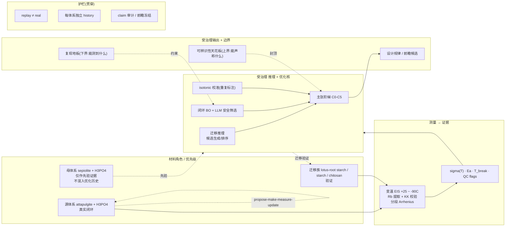

# 手稿蓝图:定位 / 撰写思路 / 图像规划 / 系统架构(2026-06-22)

> 目的:把"这篇文章是什么、怎么写、每张图为什么放、整体架构长什么样"一次讲清。目标刊=**Tier B**
> (Comm. Chemistry / Comm. Materials / CRPS / npj Comput. Mater.,IF 6–10)。所有图均有真实产物。
> 配套:`MANUSCRIPT_INTRO_METHODS.md` + `MANUSCRIPT_RESULTS_DISCUSSION_ABSTRACT.md` + `FIGURE_LEGENDS.md`
> + `PUBLICATION_READINESS.md` + `G4_POSITIONING_AND_REFERENCES.md`。

---

## 1. 文章定位(一段话)

大多数自主/自驱动发现的演示都假设有丰富的结构表征,而真实实验室常常**只有一台便宜的传输探针(EIS)**。
本文把问题改写成:**在只看得到传输数据时,一个自主 agent 到底能"可信地"声称什么?** 我们在生物聚合物–黏土–
磷酸质子导体上,用密集变温 EIS 作为唯一证据,给出两条**可测量的边界**:从下方,**制造复现地板**限定"能测到
什么";从上方,**结构可辨识性天花板**限定"能声称什么"。两条边界都从**同一批用于发现的传输数据**导出。卖点
不是材料数字,而是**"看不全的条件下,自主发现能做到什么程度 + 把握度/主张可被量化约束"**——一个诚实优先、
以负/null 结果为正面骨架的方法框架。

**为什么能投 Tier B**:(i) 真实**独立湿实验重复**(13 集 4 体系)而非模拟/文本;(ii) 把"复现地板 + 可辨识性
封顶 + 闭环诚实 null"在 EIS-only 设定下首次合并(据我们所知);(iii) 完整消融/基线对照(校准 ON/OFF、闭环 vs
纯BO vs random、agent vs popularity)+ 诚实纪律链(前瞻冻结/独立 history/claim 审计)。

---

## 2. 撰写思路(叙事主轴 + 逐节逻辑)

**主轴**:`受限条件(EIS-only)→ 发现了什么(可调亚零度转变)→ 凭什么可信(地板+校准)→ 能声称到哪(可辨识性)→ 闭环到底有没有用(诚实 null + BO/LLM 各自职责)`。一句话:**"两模式(迁移推理 / 闭环优化)、一治理核(校准的主张阶梯)、两边界(地板 / 天花板)"**。

| 节 | 任务(首句点题) | 关键真实证据 | 图 |
|---|---|---|---|
| Intro | 表征受限是真实常态;现有工作不分"发现 vs 拟合"、不量化复现极限;三技术难点(机理歧义/复现地板/闭环追噪) | — | Fig 1 |
| Methods | 材料角色 + 变温 EIS + 分段转变检测 + 复现/校准 + 可辨识性 + 受治理闭环 + 主张策略 | — | Fig 1 |
| 3.1 发现 | 跨 4 体系 13 重复的**可调亚零度转变** | T_break −22~−39°C;LRS Ea_low 0.69±0.07(7 重复);CHITO 边界反例 | Fig 2 |
| 3.2 地板 | 独立重复揭示**制造复现地板** | σ 复现 ~1.8–2.1×(0.245–0.33 dex) | Fig 3 |
| 3.3 测不准 | 单曲线 QC **不能**预测跨片复现;但重复支持校准 | 留一 AUROC≈0.52;ECE 0.78→0.13(只去过自信) | Fig 4, Fig 5 |
| 3.4 天花板 | 传输数据**只许可描述符、不许可机理** | 三机理律 ΔR²=0.006;AICc 3 段=1.0 | Fig 6 |
| 3.5 闭环 | 闭环报**诚实 null**,由地板解释 | 顶端候选差<地板;前瞻 2 轮未超最优 | Fig 3, Fig 7 |
| 3.6 消融/基线 | 各组件职责:BO=效率、LLM=安全、校准=可信、护栏=纪律 | BO 4.1 vs random 5.5;LLM 拉回 R0.02→0.28;校准 reliability↑;agent 0% vs popularity 100% 干扰 | Fig 7 |
| Discussion | 两边界框架 + 5 条诚实局限 + 未来(直接测 host 地板 / 地板感知采集) | — | — |

---

## 3. 图像规划(canonical,7 主图 + TOC;每张:内容 / 真实产物 / 放置理由)

> ⚠️ 图号已统一为下表(此前 body 个别旧号已修;最终投稿前按本表做一次交叉引用核对 = G5)。
> 数据图均为 matplotlib 真实数据(SVG 主 + TIFF600);示意图为 OpenRouter 初稿,投稿前 PPT/矢量精修。

| 图 | 标题/内容 | 真实产物 | 类型 | 支撑节 | 放置理由 |
|---|---|---|---|---|---|
| **TOC** | graphical abstract:两模式一核 + 地板/天花板 | `figures/concept_abstract_draft_0.png` | 示意 | 全文 | 一眼传达"受限下可信发现"的卖点 |
| **Fig 1** | 系统总览(母体系先验/源系统闭环/迁移验证 + 测量→证据→治理核→输出 + guardrails) | `figures/overview_v3_arrows.png`(推荐)或 v2 | 示意 | Intro/Methods | 让读者先建立"两模式一核"的全局心智模型 |
| **Fig 2** | 亚零度转变 + 13 集规律:(a) 陡峭度图 (b) T_break 条形 | `regularity/regularity.svg` | 数据 | 3.1 | headline 发现 + "普适/可调"证据(NC 门②的现实版) |
| **Fig 3** | 复现地板 vs 闭环候选:(a) combined_score 差 vs 地板带 (b) 纯σ 交叉验证 | `repro_floor/floor_vs_loop.svg` | 数据 | 3.2 / 3.5 | 立"地板"概念 + 解释闭环诚实 null 的定量根因 |
| **Fig 4** | 校准:(a) ON/OFF 可靠性图 (b) 跨数据集 KK vs 复现率 | `calibration/g2g3_ablation_diagnosis.svg` | 数据 | 3.3 / 3.6 | 证"校准去过自信(ECE 0.78→0.13)但不增分辨力"+ G2 消融 |
| **Fig 5** | 复现感知把握度负结果:留一 AUROC(M0–M3) | `calibration/repro_aware_auroc.svg` | 数据 | 3.3 | 证"单曲线测不准复现"——必须靠重复(地板的统计基石) |
| **Fig 6** | 可辨识性:(a) 三机理律 R²差0.006 (b) AICc 3 段=1.0 | `identifiability/identifiability.svg` | 数据 | 3.4 | 立"天花板":机理不可辨识→主张封顶在描述符 |
| **Fig 7** | 闭环基线对照:(a) BO vs random best-of-N (b) BO+LLM 安全筛选参数图 | `replay/strategy_comparison.svg` | 数据 | 3.5 / 3.6 | 给闭环正面骨架:BO=效率、LLM=安全;诚实 null 不变 |

**可选合并**:若目标刊偏好≤6 主图,可把 **Fig 4+Fig 5 合成一张"校准与其极限"**(reliability + AUROC + KK 诊断 4 panel);replay 诚实 null 图(`replay/replay_trajectory.svg`)放 SI。

---

## 4. 详细系统架构(基于真实情况)

### 4.1 证据—推理—治理 数据流

### 4.2 组件 × 真实落地 × 论文角色

| 组件 | 真实落地(已验证) | 论文角色 | 边界/诚实点 |
|---|---|---|---|
| 变温 EIS → 证据 | Rb 4 策略 + KK 校验 + 分段 Arrhenius(pwlf+Chow,真方法学) | 唯一证据源 | EIS-only;不补结构表征 |
| 分段转变检测 | AICc 竞争(单/2/3 段)+ Chow + 跳跃门 | Fig 2 发现 | 1 点伪尾段已排除 |
| 复现地板 | 13 集 / 19 对 |Δlogσ| 0.245–0.33 dex | Fig 3 下界 | 线 B 地板现用 LRS 代理 → G1 去代理 |
| 校准 | isotonic 留一数据集,ECE 0.78→0.13 | Fig 4 可信 | 只去过自信、不增分辨力 |
| 复现感知把握度 | 留一 AUROC≈0.52(负结果) | Fig 5 | 单曲线测不准复现 → 必须靠重复 |
| 可辨识性 | 三机理律 ΔR²=0.006;AICc 3 段=1.0 | Fig 6 上界 | 机理=假设,不声称结构 |
| 闭环 BO+LLM | ParEGO/GP + LLM 安全筛选 + 前瞻冻结 | Fig 7 / 3.5–3.6 | 诚实 null;LLM=安全非更优 |
| 治理 agent | M6–M8:0% 干扰纳入、护栏 40→0、跨模型盲评 | 3.6 消融 | 小池;迁移-推理臂 |
| 主张阶梯 C0–C5 | s14 ladder + guardrails | 贯穿 | 由可辨识性封顶(非启发式) |

### 4.3 三条线如何绑成一个故事
- **线 A(迁移)** = Fig 2 的发现 + Fig 6 的可辨识性封顶(发现到描述符层为止)。
- **线 B(闭环)** = Fig 3/7 的地板 + 诚实 null + BO/LLM 职责。
- **共用内核** = Fig 4/5 的校准与"测不准复现"(创新点2)+ 主张阶梯。
- **粘合剂** = "两条边界都从同一批传输数据导出" + 诚实纪律链。

---

## 5. 投稿装配清单(Tier B)
- **正文**:Abstract + Intro + Methods(2.1–2.8)+ Results(3.1–3.6)+ Discussion;7 主图 + 7 图注(英式、≤300 词)。
- **SI**:制样/EIS 协议、每片厚度、统计细节、replay 诚实-null 图、m6–m8 消融细节、完整参考文献。
- **投稿前 gating**(见 `PUBLICATION_READINESS.md`):G1(线B直接地板/续测 R/N)+ G5(Fig1/TOC 矢量化 + SI)+ G6(nature-polishing 措辞 + 图号交叉引用核对)。
- **落点决策**:电化学闭环 → Comm. Chemistry;材料+方法 → Comm. Materials;广义物理 → CRPS;计算方法包装 → npj Comput. Mater.。
