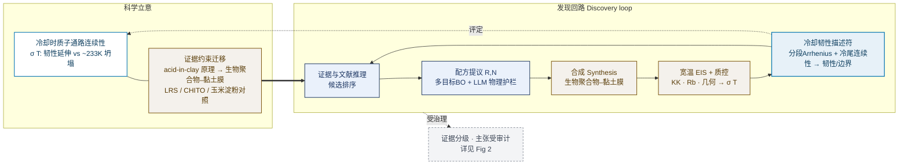

# Fig 1 出图规格 —— 科学概览图：冷却韧性质子导体的证据约束迁移与发现回路

> 用途：把本文件交给 GPT（出风格底图）或绘图工具（Illustrator / PPT / Mermaid），生成正文 Fig 1。
> **先把 `PROJECT_BRIEF_FOR_LLM.md` 喂给模型建立项目理解，再用本规格出图。** 文末附 Mermaid + PPT 施工单。
>
> 【重要定位 · 与旧版的根本差别】经调研 A-Lab(Nature)、Eunomia(Digital Discovery)、DIVE(Chem Sci) 等
> 同类论文：**Figure 1 的主角是“科学问题 + 发现回路”，不是“治理/审计流程”。** 因此本图：
> - **前景=科学**：冷却时质子通路连续性（σ(T) 韧性 vs 坍塌）、acid-in-clay→生物聚合物–黏土的迁移、发现回路。
> - **治理降权**：只在角落放一枚“证据分级·主张受审计”小徽标，**详细的门禁/三出口裁决全部交给 Fig 2**。
> - 三个创新点用小标签点出，让审稿人把图与贡献对应起来。
>
> ⚠️ **期刊图硬性约束**（沿用）：无工程编号(Stage/S01–S14)、无代码标识、无 clipart（机器人/大脑/仪器/烧瓶/人偶/盾牌）；
> 统一圆角方框 + 箭头；色盲安全色；极简扁平、无阴影渐变。

---

## 0. 一句话目标
一张图讲清科学故事：**质子导体在冷却时易“断链”坍塌；本工作用一个证据约束的智能体，把 acid-in-clay
的质子传导原理迁移到生物聚合物–黏土膜，并通过“提议配方→合成→宽温 EIS→冷却韧性描述符”的发现回路，
筛选出冷却韧性体系（LRS 正例）、识别边界体系（CHITO）。** 全过程的结论受分级证据与主张审计治理（详见 Fig 2）。

## 1. 画布与整体布局（左“科学”→ 右“回路”）
- 横版 16:9，纯白背景，双栏 183 mm 使用。
- **左区 = 科学立意**（竖向两块）：上=科学钩子 σ(T)，下=迁移概念。
- **右区 = 发现回路**（一个**闭合环**，数字侧在上、物理侧在下，描述符在右作评定）。
- **右下角 = 治理小徽标**（不喧宾夺主，标“详见 Fig 2”）。
- 颜色：数字节点浅蓝填 #EAF1FB / 深蓝框 #1F3864；物理节点浅暖灰 #F4F1EC / 棕框 #7A520A；
  描述符节点用强调色（青 #0072B2 框）；徽标中性灰。

## 2. 左上 · 科学钩子（**这是“为什么重要”，要第一眼看到**）
- 一个**小 σ(T) 示意曲线**（半对数，降温向左）：
  - **韧性曲线（LRS）**：从室温平滑延伸到 −81 °C，233 K 仍约 4×10⁻³ S cm⁻¹。
  - **坍塌曲线（CHITO）**：约 233 K 骤降约两个数量级。
  - （可选）玉米淀粉对照居中。
- 标题词：**“冷却时的质子通路连续性 Proton-pathway continuity on cooling”**。
- 含义：质子导体的实用瓶颈是低温坍塌；能否“维持通路连续”是关键。

## 3. 左下 · 迁移概念（创新点 1）
- 左：**acid-in-clay 母体原理**（磷酸约束于黏土高比表面域：packed-acid + Grotthuss、抑制酸流失）
- 中箭头：**证据约束迁移 Evidence-constrained transfer**（基于文献证据的“选择/重组”，非独立发现）
- 右：**生物聚合物–黏土膜基元 Biopolymer–clay membrane motif**（莲藕淀粉 LRS / 壳聚糖 CHITO / 玉米淀粉对照）

## 4. 右区 · 发现回路（创新点 3 的执行 + 创新点 2 的判据）
一个**闭合环**，5 个节点（数字侧蓝、物理侧棕、描述符强调色）：
1. **证据与文献推理 Reasoning over evidence & literature**（数字）→ 候选排序
2. **配方提议 Recipe proposal (R, N)**（数字）：多目标贝叶斯优化 + 大语言模型物理护栏 → **提议**（非“最优”）
3. **合成 Synthesis**（物理）：生物聚合物–黏土膜
4. **宽温 EIS + 质控 Wide-T EIS + QC**（物理）：KK · 体相电阻 · 几何审计 → σ(T)
5. **冷却韧性描述符 Cooling-resilience descriptor**（评定）：分段 Arrhenius + 冷尾连续性 → 判“韧性/边界” → 回到①
- 描述符的判定**指向左上的 σ(T) 钩子**（虚线“评定”），形成“科学问题 ↔ 发现回路”的呼应。

## 5. 右下角 · 治理小徽标（**降权**，不是主角）
- 一枚小标签/印章：**“证据分级 · 主张受审计 Evidence-graded · claim-audited”**，附极小的 ✓/⚠/✗。
- 旁注小字：**“详见 Fig 2 / See Fig. 2”**。
- 作用：点明“所有对外结论受治理”，但把门禁、三出口、措辞规则留给 Fig 2，避免与 Fig 2 重复、避免防御口吻盖过科学。

## 6. 三个创新点标签（让图与贡献对应；小号角标即可）
- ①迁移智能体（标在 §3 迁移概念上）
- ②冷却韧性描述符（标在 §4 节点 5 上）
- ③QC 门控的 BO+LLM 闭环（标在 §4 节点 2–4 上）

## 7. 视觉优先级（审稿人 5 秒抓三件事）
1. **科学问题**：冷却时通路连续 vs 坍塌（左上 σ(T)）。
2. **核心思想**：acid-in-clay → 生物聚合物–黏土 的证据约束迁移（左下）。
3. **怎么做**：提议→合成→测量→描述符评定 的发现回路（右）。治理只是角落徽标。

---

## 8. 可直接渲染的 Mermaid（推荐：先出结构，再美化）

> 注：Mermaid 出结构后，把左上 σ(T) 换成**真实曲线缩略图**（用 Fig 3 数据导出的小图），比纯文字框更有科学感。

## 9. PPT 手动绘制施工单（**最终成稿就按这张摆**）
**画布**：33.87 cm × 19.05 cm（16:9）；最终按双栏 183 mm 使用；字体 Arial（缩放后 5–7pt）；σ(T) 的下标/希腊字母用 symbol。

**左上 · 科学钩子**：插一张**真实 σ(T) 缩略图**（从 `manuscript/figures/Fig3_sigma_T.png` 的数据用 Origin 出一张干净小图：两条线 LRS 韧性 / CHITO 坍塌，标 233 K）。框线青 #0072B2。标题“冷却时质子通路连续性”。

**左下 · 迁移概念**（三件，棕框 #7A520A、浅暖灰底 #F4F1EC）：
- acid-in-clay 母体（packed-acid + Grotthuss）──「证据约束迁移」──► 生物聚合物–黏土膜（LRS/CHITO/淀粉）

**右 · 发现回路**（闭合环，箭头顺时针）：
- 证据与文献推理（蓝）→ 配方提议 R,N · MOBO+LLM 护栏（蓝）→ 合成（棕）→ 宽温 EIS+质控（棕）→ 冷却韧性描述符（青强调）→ 回到“推理”
- 描述符 ──虚线“评定”──► 左上 σ(T)

**右下角 · 治理徽标**：小圆角标签“证据分级·主张受审计 ✓⚠✗ ｜ 详见 Fig 2”，中性灰，**明显小于其他模块**。

**三个创新点角标**：①标迁移概念、②标描述符、③标回路的提议-合成-测量段（小号、不抢戏）。

**箭头**：回路用粗箭头（PPT 2–2.25pt）；迁移用中等箭头；“评定”“受治理”用细虚线。

**导出**：文件→另存为→**PDF**（矢量）。投稿前中文标签换英文、补 §10 图注。

## 10. 图注（Figure 1 legend，< 250 词，定稿用；先中文，投稿译英）
> **图 1　冷却韧性质子导体的证据约束智能体迁移与发现回路。**
> 质子导体在冷却时常因通路断裂而电导坍塌（左上）：莲藕淀粉基膜（LRS）的电导率 σ(T) 平滑延伸至
> −81 °C、233 K 仍约 4×10⁻³ S cm⁻¹，而壳聚糖基膜（CHITO）于约 233 K 坍塌近两个数量级。本工作以
> 一个证据约束的智能体，将“酸-黏土（acid-in-clay）”的质子传导原理（磷酸受限于黏土高比表面、
> packed-acid 与 Grotthuss 机制）经基于文献证据的选择与重组，迁移到生物聚合物–黏土膜基元（左下）。
> 发现以闭合回路执行（右）：智能体据证据与文献排序候选并提议配方（酸/水比 R、液/黏土比 N，
> 多目标贝叶斯优化联合大语言模型物理护栏），经合成与宽温电化学阻抗谱（含质量控制）测得 σ(T)，
> 再由冷却韧性通路连续性描述符（分段 Arrhenius 联合冷尾连续性）判定其为韧性或边界体系并回馈下一轮。
> 全流程的对外结论受分级证据与确定性主张审计治理（详见图 2）。

## 11. GPT 出图提示词（**仅出风格底图，文字最后人工叠加**）
```
A clean, journal-quality concept schematic for a materials-science paper, flat minimal vector style,
16:9, white background, generous whitespace. STRICT: NO icons, NO clipart, NO robot/brain/laptop/
instrument/flask/person/shield illustrations, NO stage numbers, NO code identifiers — only uniform
rounded rectangles, one small line-chart inset, and thin arrows.
LEFT region (two stacked elements): TOP = a small semilog line-chart inset showing two conductivity-
vs-temperature curves, one staying high and smooth toward low temperature, one collapsing sharply at
low temperature; BOTTOM = three boxes in a row connected by arrows showing a transfer concept
(parent principle -> transfer -> new membrane family), on light warm gray (#F4F1EC) with brown
(#7A520A) outlines.
RIGHT region: a single CLOSED CYCLE of five rounded boxes arranged in a ring with clockwise arrows
(reasoning -> recipe proposal -> synthesis -> measurement -> descriptor -> back to reasoning); the
top two boxes on light blue (#EAF1FB, navy #1F3864 outline) = digital steps, the bottom two on light
warm gray (brown outline) = physical steps, and the rightmost box highlighted with a teal (#0072B2)
outline = the descriptor/evaluator. A thin dashed arrow goes from the descriptor box back to the
left chart inset.
BOTTOM-RIGHT corner: one small neutral-gray badge (clearly smaller than other elements).
Colour-blind-safe accents only; no red-green pairing; no text labels, no shadows, no gradients, vector-like.
```

## 12. 与旧版/参考图的差异（为什么这样改）
- **旧 Fig 1 是“治理/架构图”**（人工批准门、证据绑定、主张审计三出口当主角）——经调研，这类内容在同类
  顶刊里属于 Methods/次级图，不该当 Figure 1；且与本文 Fig 2 重复、口吻偏防御。
- **新 Fig 1 改为“科学+发现回路”主导**：σ(T) 冷却韧性钩子、acid-in-clay→生物聚合物迁移、发现回路；
  治理降为角落徽标并指向 Fig 2。这与 A-Lab / Eunomia / DIVE 的 Figure 1 惯例一致。
- 仍满足 Nature 制图规范（矢量、色盲安全、无 clipart、无编号）。
