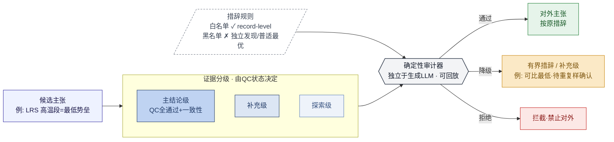

# Fig 2 出图规格 —— 分级证据与确定性主张审计

> 用途：生成放在“方法（§8.2）”的 Fig 2。这张图是本文**方法学卖点**的可视化，
> 要画成“能力流程图 / 状态机”，**不要**画成红色禁止网或“防御网”。
> **先把 `PROJECT_BRIEF_FOR_LLM.md` 喂给模型建立项目理解，再用本规格出图。**
> 文末附 Mermaid 规格（推荐）与 GPT 提示词。
>
> ⚠️ **期刊图硬性约束（与 Fig 1 一致）**：
> - **不得出现工程内部编号 / 代码标识符**（如 S14、Stage 等）；用功能语义命名。
> - **不得用 clipart 风图标**（人偶/盾牌/锁等装饰画）；只用统一圆角方框 + 箭头，
>   三出口可用极简 ✓ / ⚠ / ✗ 字符。
> - 极简、扁平、无阴影渐变、留白充足。
> - 黑名单措辞（“独立发现 / 普适最优”等）作为**审计器规则示例**呈现即可，
>   是在展示“能力”，不是“认错”——不要渲染成红色警告海报。

---

## 0. 一句话目标
展示一条对外结论如何从“候选主张”经过 **证据分级 + 确定性审计** 两道正交关卡，
被赋予匹配其证据强度的措辞（通过 / 降级 / 拒绝）。

## 1. 画布与布局
- 竖版或方形（4:3）。左→右三段式：**输入 → 双关卡 → 输出**。
- 左：候选主张（由发现层产生）。
- 中上：**证据分级**（三层阶梯：主结论 / 补充 / 探索）。
- 中下：**确定性审计器**（独立于生成 LLM，吃“结构化证据 + 措辞白/黑名单”）。
- 右：三种裁决出口。
- 配色：阶梯用蓝色三档深浅；审计器中性灰盒；白名单绿、黑名单红；三出口绿/琥珀/红。背景白、扁平。

## 2. 核心元素与精确标签

**A. 输入节点**
- “候选主张”（示例：LRS 高温段为已报道最低势垒）

**B. 证据分级阶梯（三层，自下而上或自上而下）**
- 主结论级 Main：QC 全通过 + 一致性证据 → 可作正文主结论
- 补充级 Supplement：仅置于补充信息
- 探索级 Exploratory：仅探索，不作机制证据
- 关键注记：**等级由数据的 QC 状态决定，而非结论是否“亮眼”**

**C. 确定性审计器（中心盒）**
- 两路输入：① 结构化证据（来自分级）② 措辞规则（白名单 / 黑名单）
- 性质标注：**独立于生成结论的 LLM** · **同输入同裁决（可回放）**
- 白名单示例（绿）：“可比已报道最低势垒（record-level，待外部复核）”
- 黑名单示例（红）：“世界纪录” / “独立发现” / “发现了 LRS” / “证明普适最优”

**D. 三种裁决出口**
- 通过（绿）：对外主张按原措辞陈述
- 降级（琥珀）：改写为有界措辞 / 移入补充级
- 拒绝（红）：拦截，禁止对外

## 3. 一个贯穿示例（图中可作小标注，强化“治理可用”而非“忏悔”）
候选“最低势垒” → 证据分级判定其等几何对照尚未闭合 → 审计降级为
“可比已报道最低水平、待原生重复样确认”。**强调：这是能力，不是认错。**

## 4. 视觉优先级
1. “两道正交关卡”一目了然（分级 ⟂ 审计）。
2. 审计器**独立、可回放**（区别于让同一个 LLM 自我评判）。
3. 输出是“措辞与证据强度匹配”，不是“通过/失败”二元。

---

## 5. 可直接渲染的 Mermaid 规格（推荐）


## 6. GPT 出图提示词（仅风格底图，文字后期叠加）
```
A clean infographic for a methods section: on the left an input node, in the middle a three-tier
ladder (stacked bars) feeding into a central "auditor" box that also receives a second dashed input
of "rules", and on the right three labeled exits (green check, amber down-arrow, red cross). Flat,
professional, blue-gray palette with green/amber/red accents on exits only, white background,
generous whitespace, no text, no shadows, vector-like, 4:3.
```
